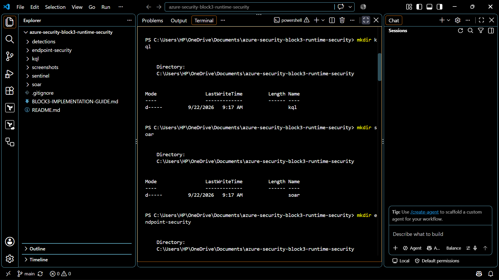
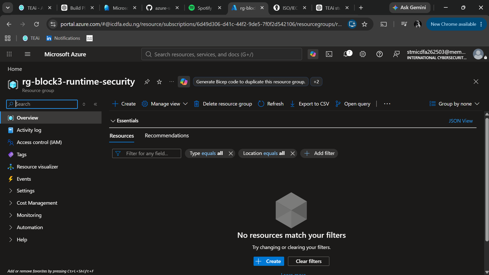
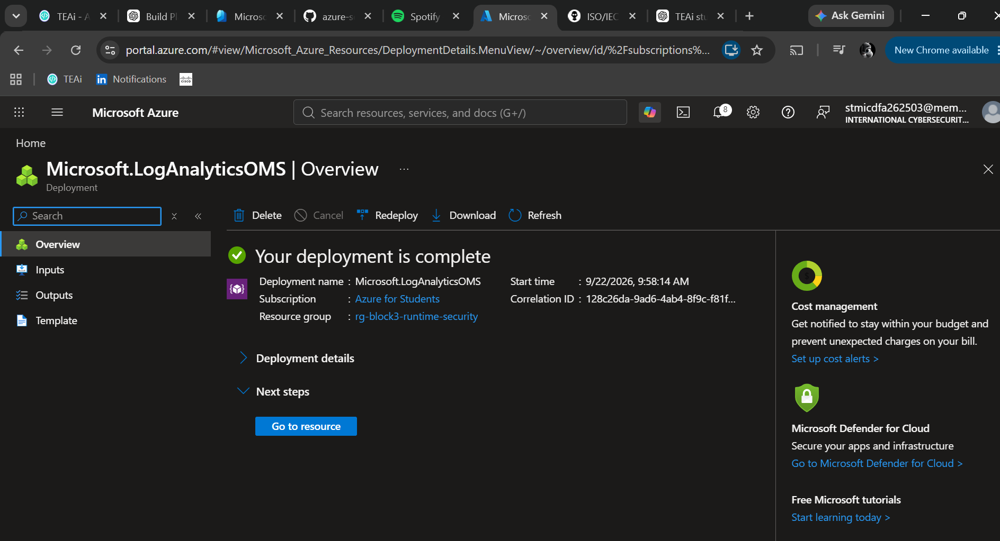
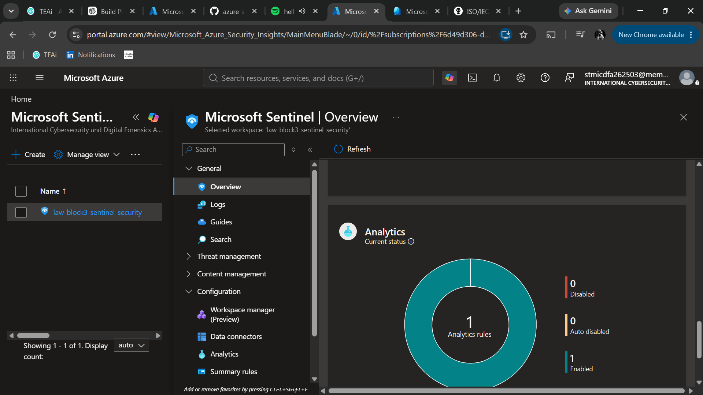
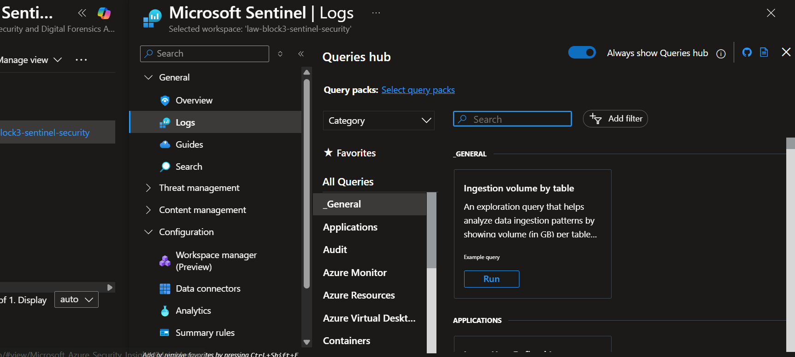
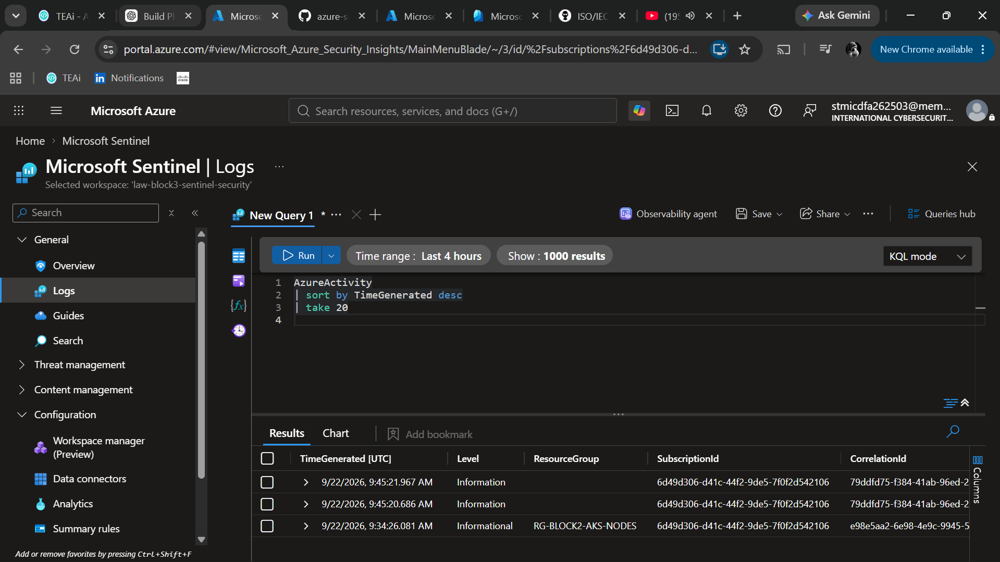
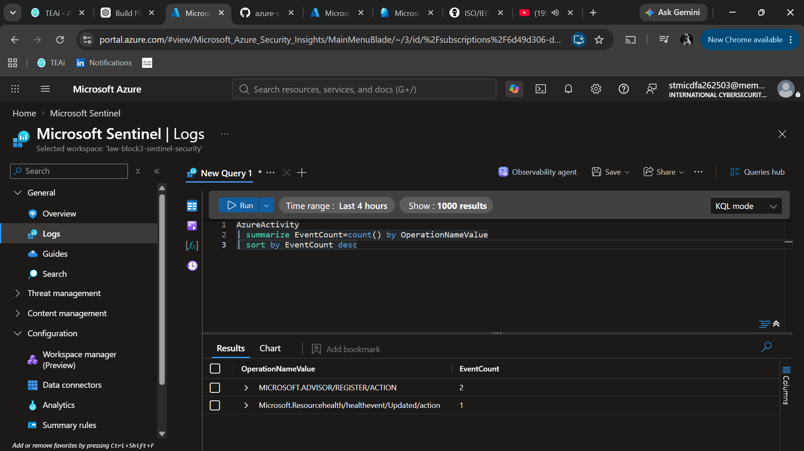
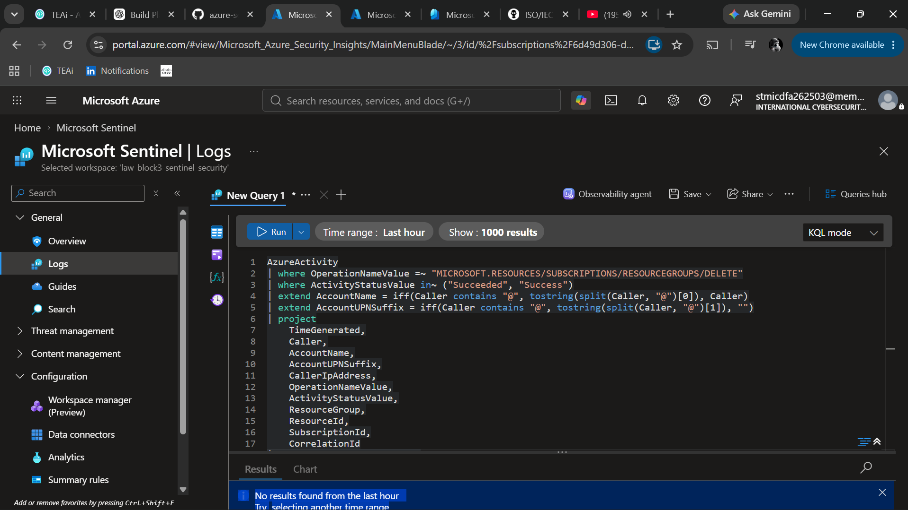
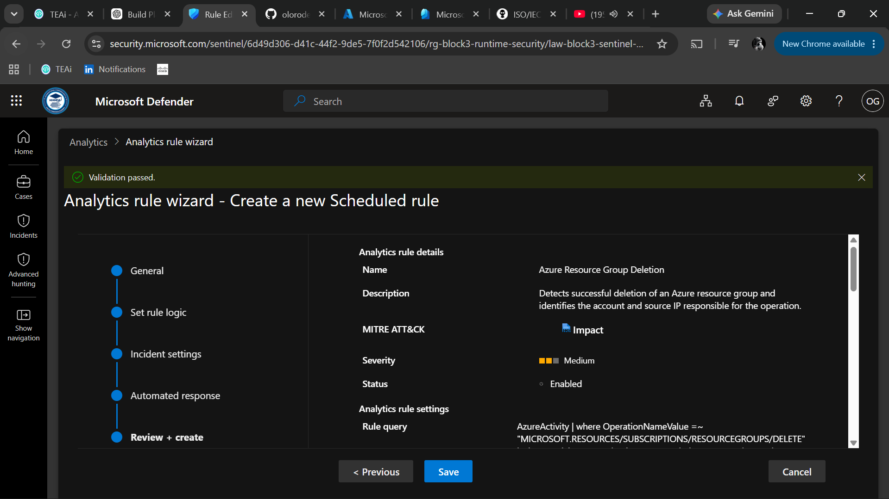
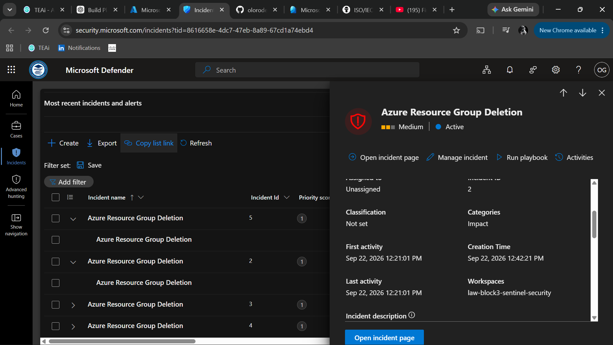

# Block 3 — Runtime Security Implementation Guide

## Overview

In Block 3, I am focusing on runtime security monitoring, SIEM engineering, detection engineering, incident investigation, endpoint security, and security automation.

Unlike Block 2, which focused on building and securing Azure infrastructure with Terraform, Block 3 focuses on monitoring activity after resources are deployed and using security telemetry to detect and investigate events.

The main technologies used in this block include Microsoft Sentinel, Log Analytics, Kusto Query Language (KQL), Microsoft Defender, custom analytics rules, and SOAR automation.

---

## Step 1 — Block 3 Project Preparation

I created a separate repository for Block 3 so that the runtime security work is maintained independently from my Block 2 infrastructure project.

The repository is named:

`azure-security-block3-runtime-security`

I created separate folders for Microsoft Sentinel, KQL queries, custom detections, endpoint security, SOAR automation, documentation, and screenshots.

The initial repository structure includes:

- `sentinel/` — Microsoft Sentinel configuration and supporting files
- `detections/` — Custom detection and analytics rule documentation
- `kql/` — KQL queries used for log analysis and threat hunting
- `endpoint-security/` — Microsoft Defender for Endpoint work
- `soar/` — Security automation and playbook documentation
- `screenshots/` — Implementation evidence
- `docs/` — Additional supporting documentation
- `README.md` — Main repository documentation
- `BLOCK3-IMPLEMENTATION-GUIDE.md` — Detailed implementation evidence

I initialized the folder as a Git repository and connected it to GitHub so that all Block 3 security configurations, queries, documentation, and evidence can be version controlled.



---

## Step 2 — Microsoft Sentinel Foundation

I created a dedicated Azure resource group for the Block 3 runtime security environment.

### Resource Group

- **Name:** `rg-block3-runtime-security`
- **Subscription:** Azure for Students

The resource group provides a dedicated location for the Azure resources used during Block 3.



### Log Analytics Workspace

I created a Log Analytics workspace to act as the central log collection and query platform for the project.

The original workspace was created in Poland Central, but Microsoft Sentinel could not be enabled because Sentinel was not available for that workspace region.

I removed the original workspace and created a new workspace in a supported region.

The final workspace configuration is:

- **Workspace:** `law-block3-sentinel-security`
- **Resource Group:** `rg-block3-runtime-security`
- **Region:** France Central
- **Subscription:** Azure for Students

This workspace will store the security telemetry used throughout the project.



### Microsoft Sentinel

I enabled Microsoft Sentinel on the `law-block3-sentinel-security` Log Analytics workspace.

Microsoft Sentinel provides the SIEM capabilities that I will use throughout Block 3 for:

- Security log collection
- KQL analysis
- Detection engineering
- Analytics rules
- Incident investigation
- Threat hunting
- Security automation

After onboarding the workspace, I confirmed that Microsoft Sentinel was associated with the correct Log Analytics workspace.



---

## Step 3 — Azure Activity Log Ingestion

After enabling Microsoft Sentinel, I configured Azure Activity logs as the first data source for the SIEM environment.

Azure Activity logs provide visibility into subscription-level control-plane operations such as:

- Resource creation
- Resource deletion
- Configuration changes
- Resource group changes
- Role and access operations
- Policy operations
- Deployment activity

### Activity Log Configuration

I configured the Azure subscription to send Activity Log data to the Block 3 Log Analytics workspace.

The destination workspace is:

`law-block3-sentinel-security`

This allows Azure administrative activity from the subscription to be stored in Log Analytics and analyzed by Microsoft Sentinel.



### Generating Test Activity

To generate a safe test event, I made a configuration change to the Block 3 resource group.

I added the following tag:

- **Name:** `Environment`
- **Value:** `Block3-Lab`

This generated Azure management activity without requiring an additional paid resource.

### Verifying Log Ingestion

I opened Microsoft Sentinel Logs and queried the `AzureActivity` table.

I used the following KQL query:

```kusto
AzureActivity
| sort by TimeGenerated desc
| take 20

```

## Step 4 — KQL Log Analysis

I used Kusto Query Language (KQL) in Microsoft Sentinel to analyze Azure Activity telemetry stored in the Log Analytics workspace.

I started by querying recent Azure Activity events and then used filtering and projection to focus on successful operations, activity associated with the Block 3 resource group, and failed Azure operations.

I also used the `summarize` operator to group Azure operations and identify which activities occurred most frequently.

The main KQL operators I practiced were:

- `where` for filtering events
- `project` for selecting specific columns
- `sort` for arranging query results
- `summarize` for grouping and aggregating data
- `take` for limiting the number of returned records

I saved the reusable queries in:

`kql/azure-activity-basics.kql`

These queries provide the foundation for the custom detection rules that will be created later in the project.






## Step 5a — Custom Detection 1: Azure Resource Group Deletion

I created my first custom Microsoft Sentinel analytics rule to detect successful deletion of an Azure resource group.

The detection uses the `AzureActivity` table and searches for successful resource group deletion operations.

The purpose of this rule is to provide visibility into destructive Azure administrative actions. Resource group deletion can be legitimate during maintenance or cleanup, but it can also represent destructive activity if performed without authorization.

### 5b Detection Query Validation

Before creating the analytics rule, I tested the KQL query directly in Microsoft Sentinel Logs to confirm that it correctly searched for Azure resource group deletion events.



### Analytics Rule Configuration

I created a scheduled analytics rule named `Azure Resource Group Deletion`.

The rule was configured with:

- Severity: Medium
- MITRE ATT&CK tactic: Impact
- MITRE ATT&CK technique: T1485 — Data Destruction
- Account entity mapping
- Source IP entity mapping
- Custom alert details
- Incident creation enabled



### 5.c Detection Testing and Incident Generation

To test the detection, I created an empty temporary resource group named:

`rg-block3-detection-test`

I then deleted the resource group and confirmed that the deletion event appeared in the `AzureActivity` table.

The custom analytics rule detected the activity and Microsoft Sentinel generated an incident named:

`Azure Resource Group Deletion`

This successfully validated the complete detection workflow:

`Azure Activity → KQL Query → Analytics Rule → Alert → Incident`



