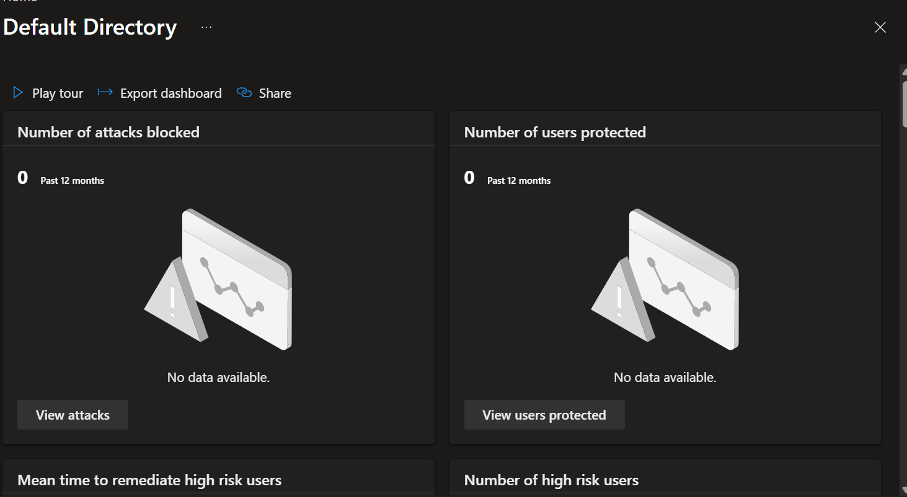
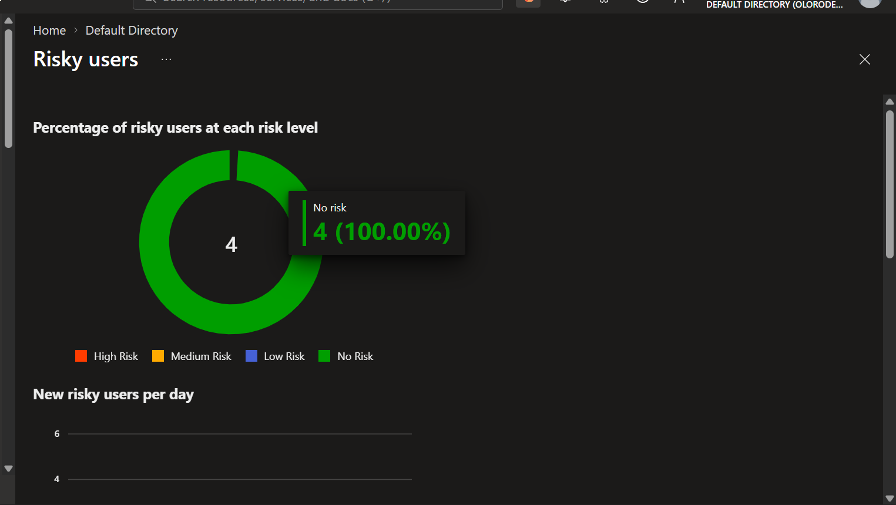
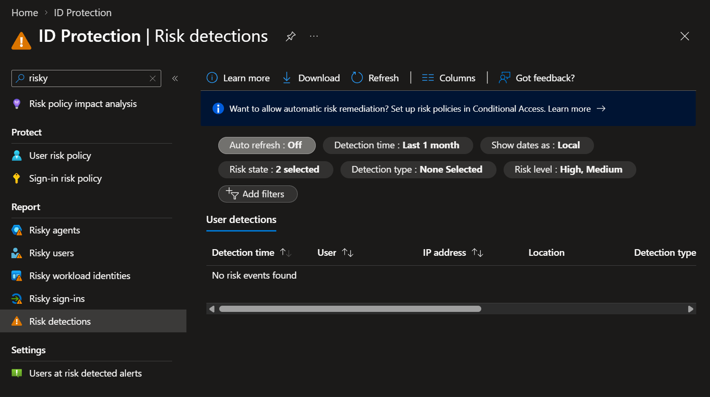
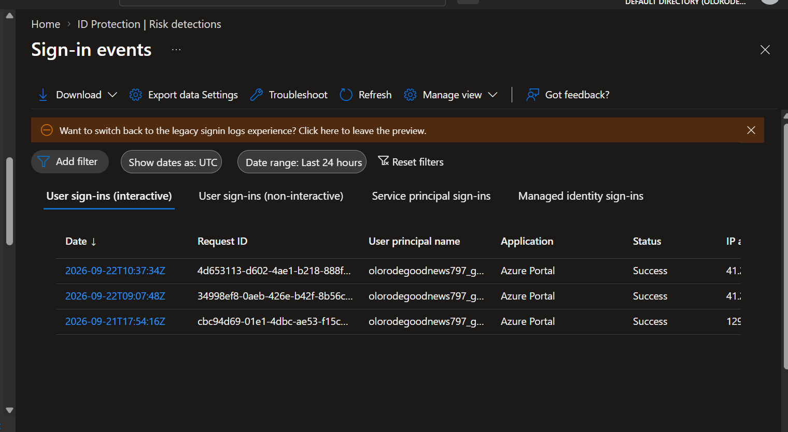
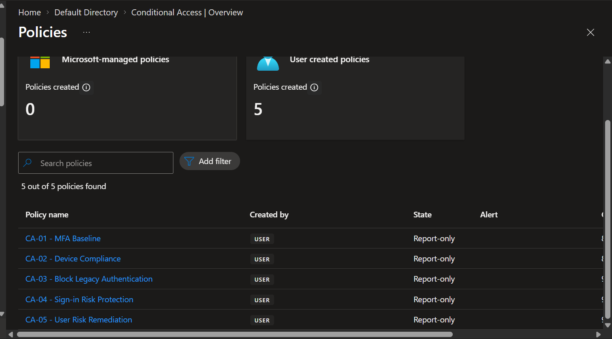
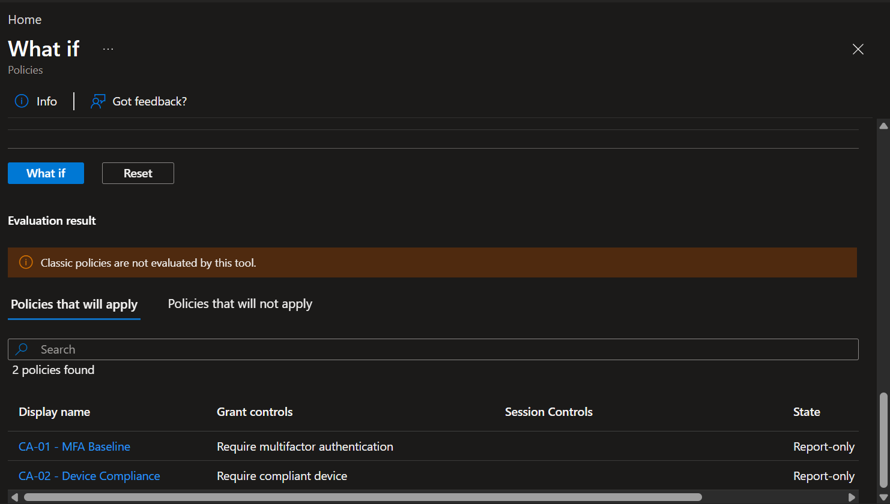
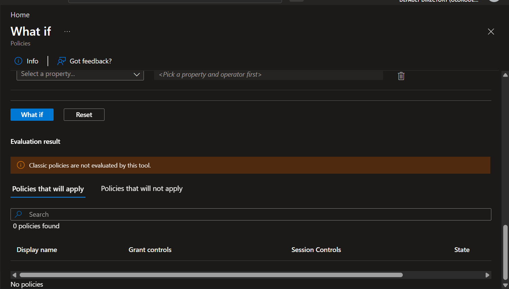
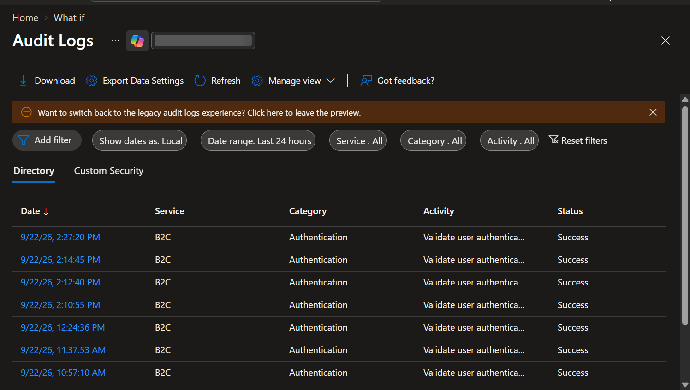
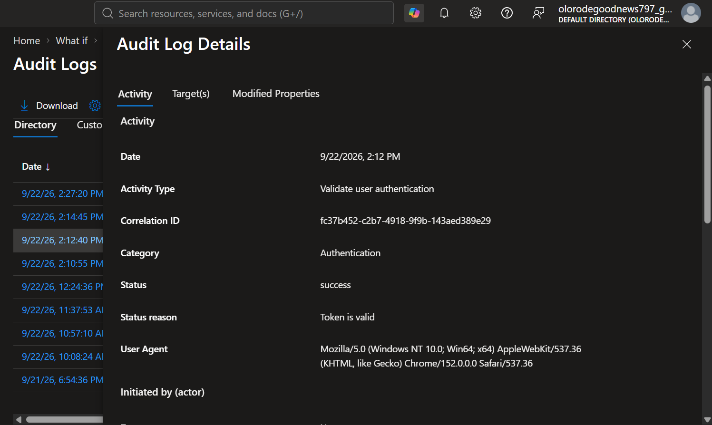
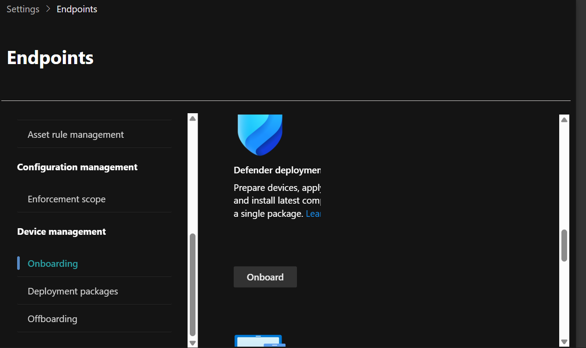

# Block 3 — Runtime Security Implementation Guide

## Overview

In Block 3, I am focusing on runtime security monitoring, SIEM engineering, detection engineering, incident investigation, endpoint security, and security automation.

Unlike Block 2, which focused on building and securing Azure infrastructure with Terraform, Block 3 focuses on monitoring activity after resources are deployed and using security telemetry to detect and investigate events.

The main technologies used in this block include Microsoft Sentinel, Log Analytics, Kusto Query Language (KQL), Microsoft Defender, custom analytics rules, and SOAR automation.

---

## Step 1 — Block 3 Project Preparation

I created a separate repository for Block 3 so that the runtime security work is maintained independently from my Block 2 infrastructure project.

The repository is named:

`azure-security-block3-runtime-security`

I created separate folders for Microsoft Sentinel, KQL queries, custom detections, endpoint security, SOAR automation, documentation, and screenshots.

The initial repository structure includes:

- `sentinel/` — Microsoft Sentinel configuration and supporting files
- `detections/` — Custom detection and analytics rule documentation
- `kql/` — KQL queries used for log analysis and threat hunting
- `endpoint-security/` — Microsoft Defender for Endpoint work
- `soar/` — Security automation and playbook documentation
- `screenshots/` — Implementation evidence
- `docs/` — Additional supporting documentation
- `README.md` — Main repository documentation
- `BLOCK3-IMPLEMENTATION-GUIDE.md` — Detailed implementation evidence

I initialized the folder as a Git repository and connected it to GitHub so that all Block 3 security configurations, queries, documentation, and evidence can be version controlled.


---

## Step 2 — Microsoft Sentinel Foundation

I created a dedicated Azure resource group for the Block 3 runtime security environment.

### Resource Group

- **Name:** `rg-block3-runtime-security`
- **Subscription:** Azure for Students

The resource group provides a dedicated location for the Azure resources used during Block 3.


### Log Analytics Workspace

I created a Log Analytics workspace to act as the central log collection and query platform for the project.

The original workspace was created in Poland Central, but Microsoft Sentinel could not be enabled because Sentinel was not available for that workspace region.

I removed the original workspace and created a new workspace in a supported region.

The final workspace configuration is:

- **Workspace:** `law-block3-sentinel-security`
- **Resource Group:** `rg-block3-runtime-security`
- **Region:** France Central
- **Subscription:** Azure for Students

This workspace will store the security telemetry used throughout the project.


### Microsoft Sentinel

I enabled Microsoft Sentinel on the `law-block3-sentinel-security` Log Analytics workspace.

Microsoft Sentinel provides the SIEM capabilities that I will use throughout Block 3 for:

- Security log collection
- KQL analysis
- Detection engineering
- Analytics rules
- Incident investigation
- Threat hunting
- Security automation

After onboarding the workspace, I confirmed that Microsoft Sentinel was associated with the correct Log Analytics workspace.


---

## Step 3 — Azure Activity Log Ingestion

After enabling Microsoft Sentinel, I configured Azure Activity logs as the first data source for the SIEM environment.

Azure Activity logs provide visibility into subscription-level control-plane operations such as:

- Resource creation
- Resource deletion
- Configuration changes
- Resource group changes
- Role and access operations
- Policy operations
- Deployment activity

### Activity Log Configuration

I configured the Azure subscription to send Activity Log data to the Block 3 Log Analytics workspace.

The destination workspace is:

`law-block3-sentinel-security`

This allows Azure administrative activity from the subscription to be stored in Log Analytics and analyzed by Microsoft Sentinel.


### Generating Test Activity

To generate a safe test event, I made a configuration change to the Block 3 resource group.

I added the following tag:

- **Name:** `Environment`
- **Value:** `Block3-Lab`

This generated Azure management activity without requiring an additional paid resource.

### Verifying Log Ingestion

I opened Microsoft Sentinel Logs and queried the `AzureActivity` table.

I used the following KQL query:

```kusto
AzureActivity
| sort by TimeGenerated desc
| take 20

```

## Step 4 — KQL Log Analysis

I used Kusto Query Language (KQL) in Microsoft Sentinel to analyze Azure Activity telemetry stored in the Log Analytics workspace.

I started by querying recent Azure Activity events and then used filtering and projection to focus on successful operations, activity associated with the Block 3 resource group, and failed Azure operations.

I also used the `summarize` operator to group Azure operations and identify which activities occurred most frequently.

The main KQL operators I practiced were:

- `where` for filtering events
- `project` for selecting specific columns
- `sort` for arranging query results
- `summarize` for grouping and aggregating data
- `take` for limiting the number of returned records

I saved the reusable queries in:

`kql/azure-activity-basics.kql`

These queries provide the foundation for the custom detection rules that will be created later in the project.


## Step 5a — Custom Detection 1: Azure Resource Group Deletion

I created my first custom Microsoft Sentinel analytics rule to detect successful deletion of an Azure resource group.

The detection uses the `AzureActivity` table and searches for successful resource group deletion operations.

The purpose of this rule is to provide visibility into destructive Azure administrative actions. Resource group deletion can be legitimate during maintenance or cleanup, but it can also represent destructive activity if performed without authorization.

### 5b Detection Query Validation

Before creating the analytics rule, I tested the KQL query directly in Microsoft Sentinel Logs to confirm that it correctly searched for Azure resource group deletion events.


### Analytics Rule Configuration

I created a scheduled analytics rule named `Azure Resource Group Deletion`.

The rule was configured with:

- Severity: Medium
- MITRE ATT&CK tactic: Impact
- MITRE ATT&CK technique: T1485 — Data Destruction
- Account entity mapping
- Source IP entity mapping
- Custom alert details
- Incident creation enabled


### 5.c Detection Testing and Incident Generation

To test the detection, I created an empty temporary resource group named:

`rg-block3-detection-test`

I then deleted the resource group and confirmed that the deletion event appeared in the `AzureActivity` table.

The custom analytics rule detected the activity and Microsoft Sentinel generated an incident named:

`Azure Resource Group Deletion`

This successfully validated the complete detection workflow:

`Azure Activity → KQL Query → Analytics Rule → Alert → Incident`


## Step 7 — Microsoft Entra Runtime Identity Security Investigation

In this step, I moved from configuring identity security controls to reviewing how identity activity can be monitored and investigated at runtime.

My Microsoft Entra ID P2 environment is hosted in a separate tenant from the Azure for Students subscription used for Microsoft Sentinel. Because of this tenant separation, I treated the Entra environment as a separate identity-security data source for Block 3.

The main areas reviewed were:

- Microsoft Entra Identity Protection
- Risky users
- Risky sign-ins
- Risk detections
- Sign-in investigation
- Conditional Access runtime validation
- Privileged Identity Management
- Microsoft Entra audit logs

---

### Step 7.1 — Microsoft Entra Identity Protection Overview

I opened Microsoft Entra Identity Protection to review the identity risk monitoring capabilities available in the P2-licensed tenant.

The Identity Protection dashboard provides visibility into identity-related risk information and helps security teams investigate potentially compromised identities and suspicious authentication activity.

At the time of the review, the environment did not contain active attack or user-risk data. This was expected in the lab environment, and I did not attempt to generate unsafe or intentionally malicious authentication activity simply to create risk events.

**Screenshot evidence:**



---

### Step 7.2 — Risky Users Investigation

I reviewed the **Risky users** report in Microsoft Entra Identity Protection.

This report is used to identify accounts that Microsoft has determined may be compromised or associated with suspicious activity.

I reviewed the available fields, including:

- User
- Risk level
- Risk state
- Risk detail
- Last updated time

Even where no risky users were present, reviewing this page demonstrated how risky identities would be identified and prioritized during an investigation.

**Screenshot evidence:**



---

### Step 7.3 — Risky Sign-ins Investigation

I reviewed the **Risky sign-ins** report to understand how suspicious authentication events are presented to an analyst.

Risky sign-in investigations can provide information such as:

- User
- Application
- IP address
- Location
- Risk level
- Risk state
- Authentication information
- Conditional Access evaluation
- Device information

I reviewed the available sign-in risk data without attempting to artificially create a malicious sign-in.


---

### Step 7.4 — Risk Detection Review

I opened the **Risk detections** section of Microsoft Entra Identity Protection.

Risk detections represent individual signals that may contribute to the risk state of a user or authentication event.

I reviewed the available information such as:

- Detection type
- User
- Risk level
- Risk state
- IP address
- Location
- Detection time

This provided visibility into how Microsoft Entra presents identity-related risk signals for investigation.

**Screenshot evidence:**



---

### Step 7.5 — Sign-in Log Investigation

I opened Microsoft Entra sign-in logs and selected one of my own successful authentication events.

I reviewed the sign-in from a security analyst perspective rather than only confirming whether authentication succeeded.

The investigation included:

- User identity
- Application accessed
- Sign-in status
- IP address
- Location
- Authentication requirement
- Authentication details
- MFA information
- Conditional Access evaluation
- Device information

This allowed me to understand the context surrounding an authentication event and determine how the identity was authenticated and what security controls were evaluated.

**Screenshot evidence:**



---

### Step 7.6 — Conditional Access Policy Review

I reviewed the Conditional Access policies that had previously been created in the tenant.

The environment contained five user-created Conditional Access policies:

- `CA-01 - MFA Baseline`
- `CA-02 - Device Compliance`
- `CA-03 - Block Legacy Authentication`
- `CA-04 - Sign-in Risk Protection`
- `CA-05 - User Risk Remediation`

The policies remained in **Report-only** mode so that their behavior could be evaluated safely without unintentionally blocking legitimate access.

This is especially important in a security lab because a Conditional Access policy should be validated before broader enforcement.

**Screenshot evidence:**



---

### Step 7.7 — Conditional Access What If Validation

I used the Conditional Access **What If** tool to validate how policies would apply under different authentication scenarios.

I first tested a normal user against the configured application, client, and device conditions.

The result showed which Conditional Access policies would apply and which policies would not apply to the selected user and conditions.

This provided a safe method for validating policy scope without requiring a real production login to be blocked.

**Screenshot evidence:**



I then repeated the test using the emergency access account `BG-Admin-01`.

This account had previously been excluded from the Conditional Access policies so that emergency administrative access would remain available if normal access controls caused an unexpected lockout.

The What If results allowed me to verify that the emergency account was outside the intended policy scope.

**Screenshot evidence:**



---

### Step 7.8 — Privileged Identity Management Review

I reviewed Microsoft Entra Privileged Identity Management to examine how privileged roles are handled using temporary and auditable access.

I reviewed eligible role assignments rather than relying only on permanent administrative privileges.

This demonstrated the principle of just-in-time privileged access, where administrative privileges can be made eligible and activated only when required.

I also reviewed the privileged role activation/request workflow.

The workflow can require controls such as:

- Business justification
- MFA
- Approval
- Limited activation duration

These controls reduce the amount of time that highly privileged access remains active.

I then reviewed the PIM request or activation history to confirm that privileged access actions could be audited after they occurred.

---

### Step 7.9 — Microsoft Entra Audit Log Investigation

I used Microsoft Entra audit logs to investigate security and configuration changes performed in the tenant.

I first reviewed audit activity associated with Conditional Access.

Audit logs allow an analyst to determine:

- What activity occurred
- When the activity occurred
- Whether it succeeded
- Who initiated the activity
- Which object was affected
- What properties were modified

**Screenshot evidence:**



I then opened an individual audit event and reviewed its investigation details.

Important fields included:

- Activity
- Date and time
- Result
- Initiated by
- Target resource
- Correlation ID
- Modified properties

This demonstrated how configuration changes can be traced back to the identity that initiated them.

**Screenshot evidence:**



I also reviewed audit evidence associated with privileged identity activity.

This provided visibility into privileged role operations and demonstrated that privileged access activity can be tracked after the event occurs.

Finally, I reviewed an additional identity or security-related audit event to demonstrate investigation of security configuration changes in the tenant.

---

### Step 7 Outcome

At the end of the Microsoft Entra runtime security section, I had demonstrated how to investigate identity activity rather than only configure preventive controls.

I reviewed:

- Identity Protection
- Risky users
- Risky sign-ins
- Risk detections
- Authentication events
- MFA and Conditional Access evaluation
- Conditional Access policy scope
- Emergency account exclusions
- PIM eligible access
- Privileged access activity
- Entra audit logs
- Identity configuration changes

This provided practical experience with identity monitoring, privileged-access governance, and runtime identity investigation.

---

## Step 8 — Microsoft Defender Security Capability Review

In this step, I accessed the Microsoft Defender portal to review the endpoint security and XDR capabilities available in the licensed tenant.

The Defender portal provided access to security areas including:

- Incidents
- Advanced Hunting
- Investigation and response
- Threat intelligence
- Assets
- Identities
- Endpoint security settings

Because the Microsoft Defender environment was hosted in the licensed Entra tenant while my Microsoft Sentinel workspace was hosted in a separate Azure for Students tenant, I did not connect the Sentinel workspace to this Defender tenant.

---

### Step 8.1 — Defender for Endpoint Onboarding Review

I navigated to the Microsoft Defender for Endpoint onboarding configuration.

The onboarding interface confirmed that endpoint onboarding capabilities were available in the tenant.

The portal provided options for preparing and onboarding Windows endpoints into Microsoft Defender for Endpoint.

**Screenshot evidence:**



---

### Step 8.2 — Endpoint Onboarding Decision

A Windows endpoint was not onboarded as part of this Block 3 lab.

I intentionally stopped at the onboarding stage rather than claiming endpoint telemetry, device investigation, or response actions that were not actually performed.

The onboarding capability was reviewed and documented, but the following activities were not performed:

- Defender for Endpoint device onboarding
- Endpoint telemetry collection
- Device isolation
- Investigation package collection
- Live response
- Endpoint Advanced Hunting against an onboarded device
- Attack Surface Reduction deployment through Defender

This distinction keeps the implementation evidence accurate and ensures that the repository documents only the security capabilities that were actually implemented or validated.

---

### Step 8 Outcome

I successfully accessed the Microsoft Defender security environment and reviewed the Defender for Endpoint onboarding capability.

Although endpoint onboarding was not completed, this step provided an understanding of where endpoint security would integrate into the broader Block 3 runtime security architecture.

The remaining hands-on Block 3 work continues primarily in Microsoft Sentinel, where I will complete additional custom detections, SIEM engineering, security automation, and incident-response workflows.
