# Block 3 — Runtime Security Implementation Guide

## Overview

In Block 3, I focused on runtime security monitoring, SIEM engineering, detection engineering, identity investigation, and security automation.

Unlike Block 2, which focused on building and securing infrastructure, Block 3 focused on what happens after resources are deployed: collecting security telemetry, querying logs, detecting security-relevant actions, investigating incidents, and automating incident triage.

The main technologies used in this block were:

- Microsoft Sentinel
- Azure Log Analytics
- Azure Activity Logs
- Kusto Query Language (KQL)
- Microsoft Entra ID
- Microsoft Entra Identity Protection
- Conditional Access
- Microsoft Defender
- Microsoft Sentinel Analytics Rules
- Microsoft Sentinel Automation Rules
- GitHub

The completed detection-engineering scope contains four fully validated custom Microsoft Sentinel detections.

I also started an additional Azure Key Vault detection. The Key Vault detection configuration and test work are documented separately, but it is not counted among the four completed detections because the final event and incident validation were not completed.

---

# Step 1 — Block 3 Documentation Preparation

I created a separate Documentation repository for Block 3 so that runtime security work could be maintained independently from my Block 2 infrastructure Documentation.

The repository was structured to separate KQL queries, custom detections, Microsoft Sentinel work, endpoint-security work, SOAR automation, documentation, and screenshot evidence.

The repository structure included:

- `detections/`
- `docs/`
- `endpoint-security/`
- `kql/`
- `screenshots/`
- `sentinel/`
- `soar/`
- `.gitignore`
- `README.md`
- `BLOCK3-IMPLEMENTATION-GUIDE.md`

I initialized the project as a Git repository and connected it to GitHub.

### Screenshot Evidence

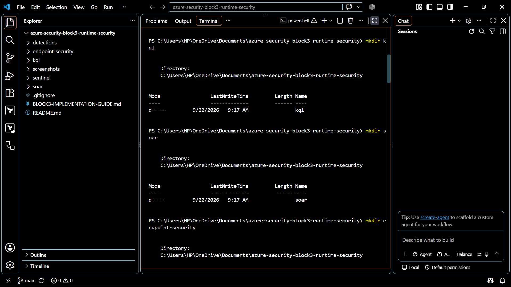

---

# Step 2 — Microsoft Sentinel Foundation

## Step 2.1 — Create the Block 3 Resource Group

I created a dedicated Azure resource group for the Block 3 runtime security environment.

- **Resource group:** `rg-block3-runtime-security`
- **Subscription:** Azure for Students

This resource group was used to organize the Azure resources created for the runtime-security lab.

### Screenshot Evidence

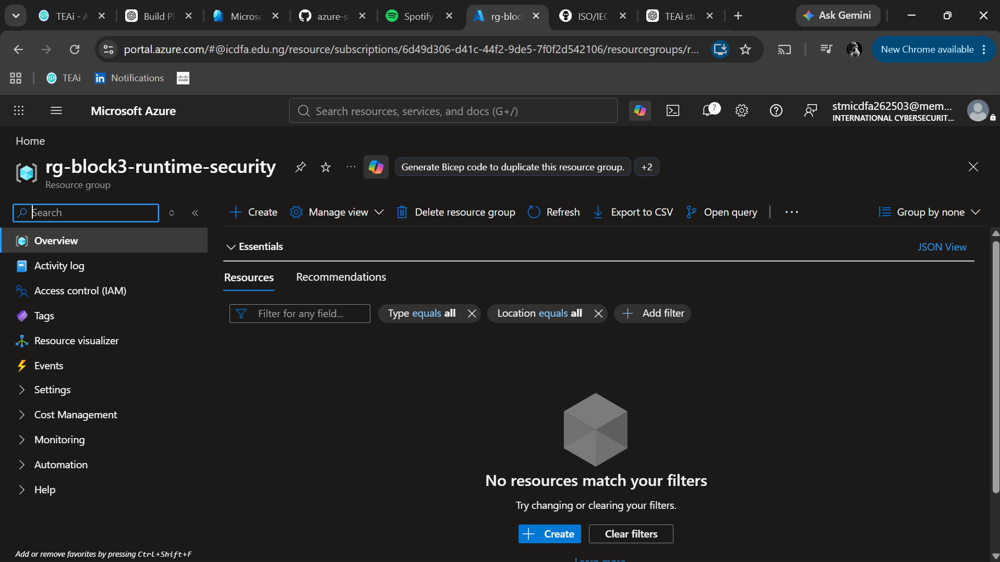

---

## Step 2.2 — Create the Log Analytics Workspace

I created a Log Analytics workspace to act as the central location for collecting and querying security telemetry.

The final workspace used for the project was:

- **Workspace:** `law-block3-sentinel-security`
- **Resource group:** `rg-block3-runtime-security`
- **Region:** France Central
- **Subscription:** Azure for Students

The workspace provides the log-storage and query platform used by Microsoft Sentinel throughout the project.

### Screenshot Evidence

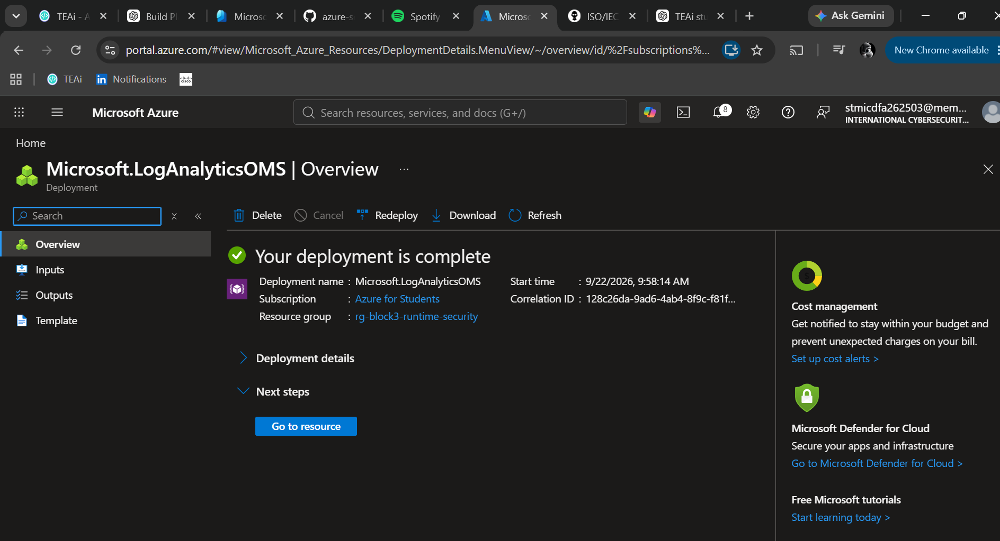

---

## Step 2.3 — Enable Microsoft Sentinel

I enabled Microsoft Sentinel on the `law-block3-sentinel-security` Log Analytics workspace.

Microsoft Sentinel provided the SIEM capabilities used throughout Block 3 for:

- Log analysis
- KQL queries
- Detection engineering
- Security alerts
- Incident investigation
- Automation

### Screenshot Evidence

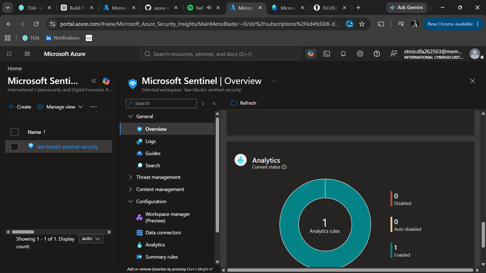

---

# Step 3 — Azure Activity Log Ingestion

I configured Azure Activity logs as the first data source for Microsoft Sentinel.

Azure Activity logs provide control-plane visibility into Azure administrative operations such as:

- Resource creation
- Resource deletion
- RBAC changes
- Azure Policy changes
- Network configuration changes
- Deployment operations
- Subscription-level administrative activity

I configured the Azure subscription to send Activity Log data to the Block 3 Log Analytics workspace.

### Screenshot Evidence

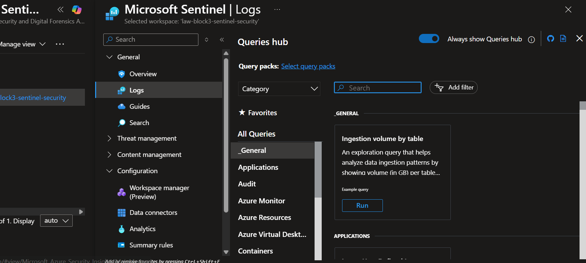

After configuring the connector, I generated normal Azure administrative activity and queried the `AzureActivity` table in Microsoft Sentinel.

I used:

```kusto
AzureActivity
| sort by TimeGenerated desc
| take 20
```

The returned events confirmed that Azure Activity telemetry was being ingested successfully.

### Screenshot Evidence

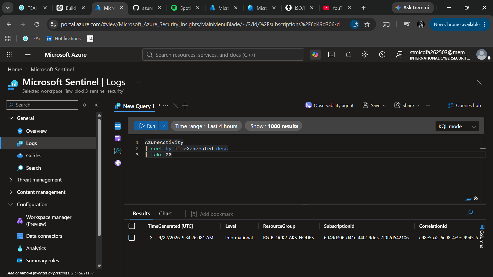

---

# Step 4 — KQL Log Analysis

I used Kusto Query Language (KQL) to analyze Azure Activity telemetry collected in Microsoft Sentinel.

I practiced the main operators required for later detection engineering:

- `where` for filtering events
- `project` for selecting specific columns
- `sort` for arranging query results
- `summarize` for grouping and aggregating data
- `take` for limiting returned records

---

## Step 4.1 — Review Recent Azure Activity

I queried recent Azure Activity events using:

```kusto
AzureActivity
| sort by TimeGenerated desc
| take 20
```

This allowed me to review the latest Azure control-plane activity collected by Sentinel.

### Screenshot Evidence

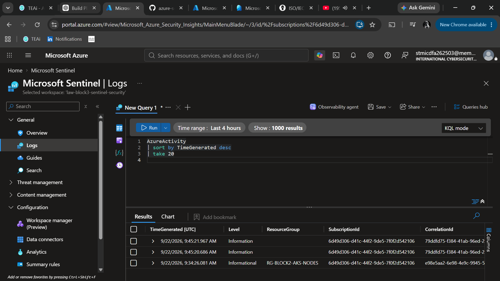

---

## Step 4.2 — Summarize Azure Operations

I used KQL to identify which Azure administrative operations occurred most frequently.

```kusto
AzureActivity
| summarize EventCount=count() by OperationNameValue
| sort by EventCount desc
```

This provided a basic activity baseline that could later support detection decisions.

### Screenshot Evidence

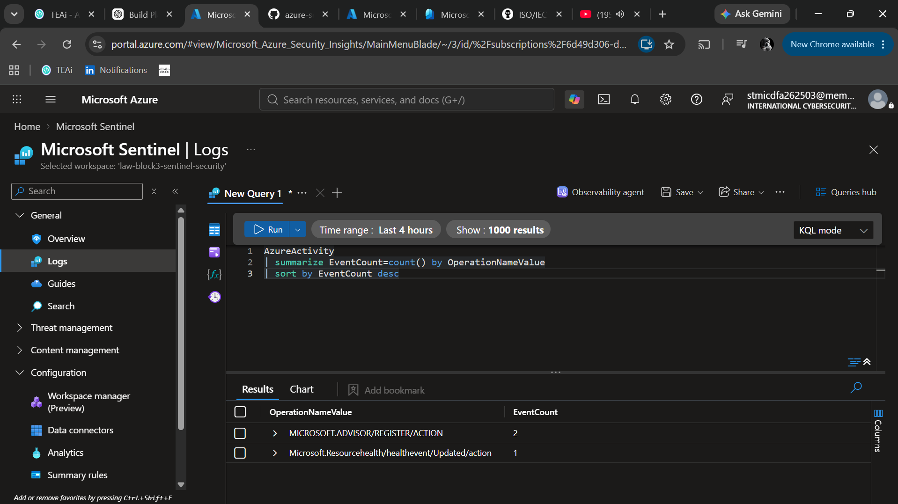

I stored reusable KQL queries inside the `kql/` directory.

---

# Step 5 — Custom Detection 1: Azure Resource Group Deletion

In this step, I created my first custom Microsoft Sentinel analytics rule.

The detection identifies successful deletion of an Azure resource group.

Resource-group deletion is a high-impact administrative action because deleting a resource group can remove multiple Azure resources at the same time.

Although this action may be legitimate during approved cleanup, an unexpected deletion can also represent destructive or unauthorized activity.

## Detection Overview

- **Detection name:** Azure Resource Group Deletion
- **Log source:** Azure Activity
- **Table:** `AzureActivity`
- **Severity:** Medium
- **MITRE ATT&CK tactic:** Impact
- **MITRE ATT&CK technique:** T1485 — Data Destruction
- **Trigger:** Successful resource group deletion
- **Possible false positive:** Authorized administrative cleanup
- **Response:** Verify authorization, identify the caller and source IP address, review affected resources, and investigate related Azure activity.

---

## Step 5.1 — Develop and Test the Detection Query

I developed a KQL query that searches for successful Azure resource-group deletion operations.

```kusto
AzureActivity
| where OperationNameValue =~ "MICROSOFT.RESOURCES/SUBSCRIPTIONS/RESOURCEGROUPS/DELETE"
| where ActivityStatusValue in~ ("Succeeded", "Success")
| extend AccountName = iff(Caller contains "@", tostring(split(Caller, "@")[0]), Caller)
| extend AccountUPNSuffix = iff(Caller contains "@", tostring(split(Caller, "@")[1]), "")
| project
    TimeGenerated,
    Caller,
    AccountName,
    AccountUPNSuffix,
    CallerIpAddress,
    OperationNameValue,
    ActivityStatusValue,
    ResourceGroup,
    ResourceId,
    SubscriptionId,
    CorrelationId
| sort by TimeGenerated desc
```

I saved the detection logic in:

`detections/01-resource-group-deletion.kql`

### Screenshot Evidence

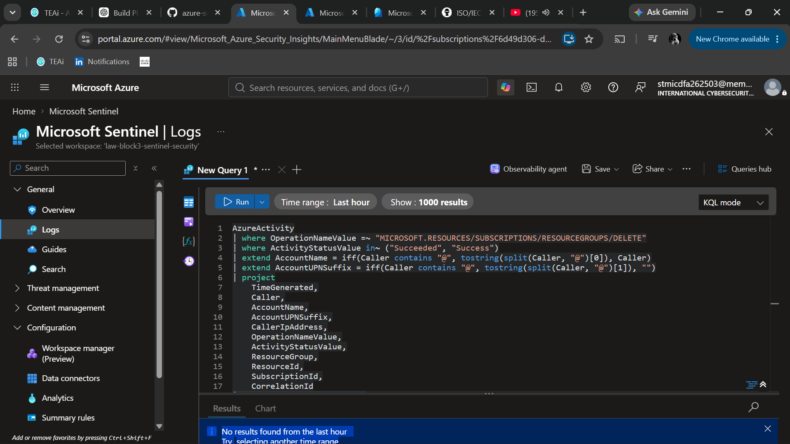

---

## Step 5.2 — Create and Enable the Analytics Rule

After validating the KQL query, I created a scheduled Microsoft Sentinel analytics rule.

I configured:

- Severity
- MITRE ATT&CK mapping
- Scheduled query logic
- Account and IP investigation context
- Incident creation

The rule was enabled so that matching Azure Activity events would generate security alerts and incidents.

### Screenshot Evidence

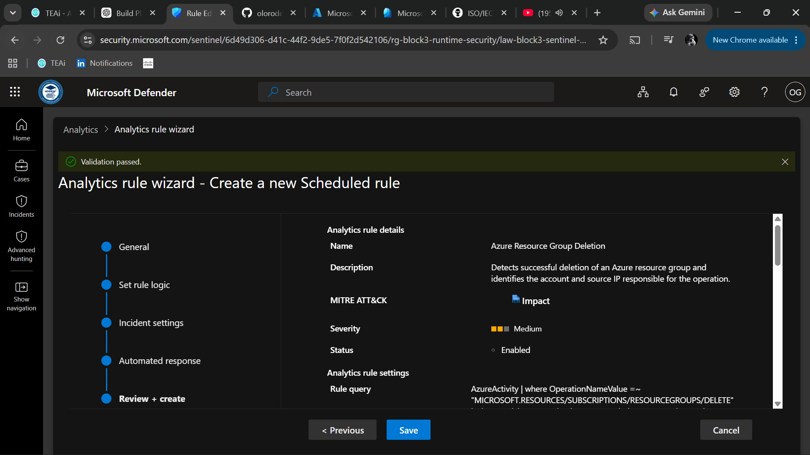

---

## Step 5.3 — Validate the Detection

To test the detection safely, I created and deleted a temporary empty resource group.

The deletion generated a real Azure control-plane event.

Microsoft Sentinel detected the activity and generated an incident named:

`Azure Resource Group Deletion`

This validated the complete workflow:

`Azure Activity → KQL → Analytics Rule → Alert → Incident`

### Screenshot Evidence

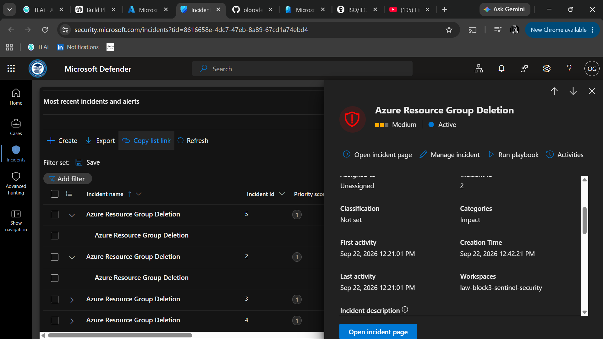

---

## Step 5 Outcome

Detection 1 was successfully implemented and validated.

---

# Step 6 — Custom Detection 2: Azure RBAC Role Assignment Changes

In this step, I created a custom Microsoft Sentinel analytics rule to detect successful creation, modification, or deletion of Azure RBAC role assignments.

RBAC changes are security-sensitive because they can modify who has access to Azure resources and what actions an identity is allowed to perform.

## Detection Overview

- **Detection name:** Azure RBAC Role Assignment Change
- **Log source:** Azure Activity
- **Table:** `AzureActivity`
- **Severity:** Medium
- **Trigger:** Successful RBAC role assignment creation, update, or deletion
- **Possible false positive:** Approved access administration
- **Response:** Verify the administrator, affected scope, target principal, assigned role, and whether the change was authorized.

---

## Step 6.1 — Develop and Test the Detection Query

I used:

```kusto
AzureActivity
| where OperationNameValue in~ (
    "MICROSOFT.AUTHORIZATION/ROLEASSIGNMENTS/WRITE",
    "MICROSOFT.AUTHORIZATION/ROLEASSIGNMENTS/DELETE"
)
| where ActivityStatusValue in~ ("Succeeded", "Success")
| extend AccountName = iff(Caller contains "@", tostring(split(Caller, "@")[0]), Caller)
| extend AccountUPNSuffix = iff(Caller contains "@", tostring(split(Caller, "@")[1]), "")
| extend RBACAction = case(
    OperationNameValue has "/WRITE", "Role Assignment Created or Updated",
    OperationNameValue has "/DELETE", "Role Assignment Deleted",
    "Unknown"
)
| project
    TimeGenerated,
    Caller,
    AccountName,
    AccountUPNSuffix,
    CallerIpAddress,
    RBACAction,
    OperationNameValue,
    ActivityStatusValue,
    ResourceGroup,
    ResourceId,
    SubscriptionId,
    CorrelationId
| sort by TimeGenerated desc
```

The reusable detection was stored in:

`detections/02-rbac-role-assignment-changes.kql`

### Screenshot Evidence

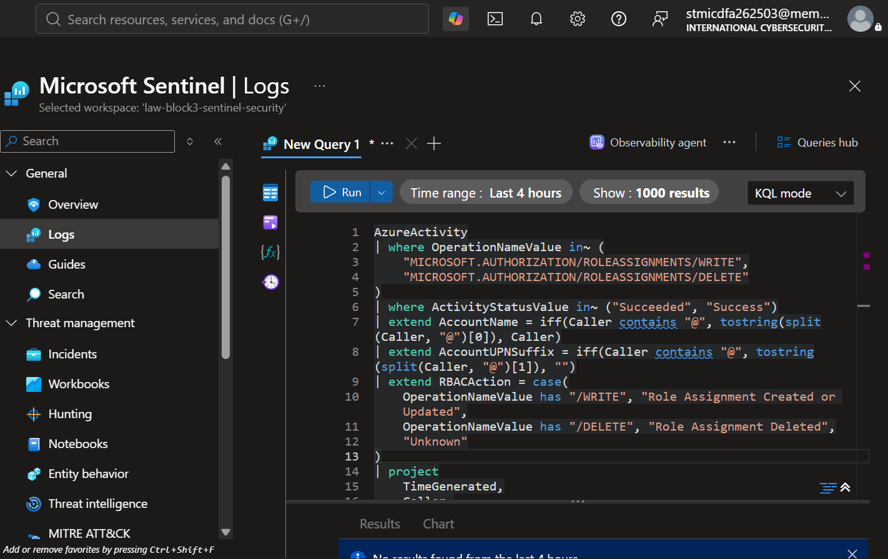

---

## Step 6.2 — Configure the Analytics Rule

I created the scheduled analytics rule and configured the validated KQL detection logic.

### Screenshot Evidence

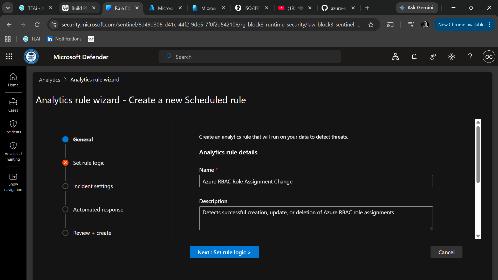

---

## Step 6.3 — Configure Entity Mapping

I mapped investigation entities so that the generated incident would include useful identity and network information.

I configured:

- Account name
- UPN suffix
- Source IP address

### Screenshot Evidence

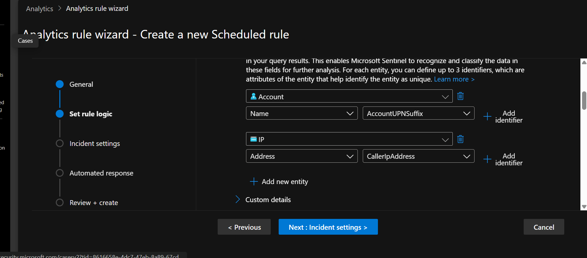

---

## Step 6.4 — Configure Custom Details

I added custom alert details for:

- Caller
- RBAC action
- Resource group
- Resource ID
- Operation
- Status

### Screenshot Evidence

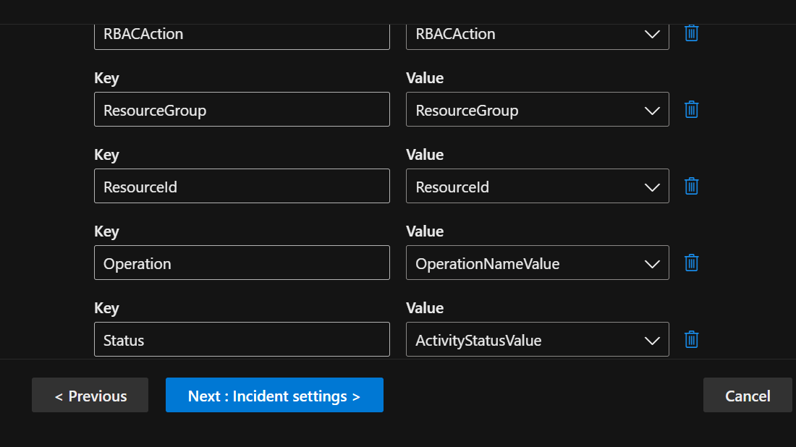

---

## Step 6.5 — Create the Rule

I completed the scheduling, alert threshold, incident settings, and enabled the rule.

### Screenshot Evidence

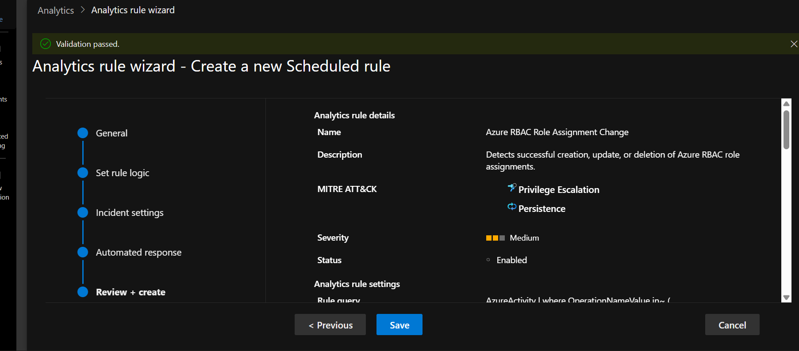

---

## Step 6.6 — Generate a Controlled RBAC Event

I created a temporary Reader role assignment for testing.

This generated a real Azure RBAC control-plane event without changing Microsoft Entra administrator roles.

### Screenshot Evidence

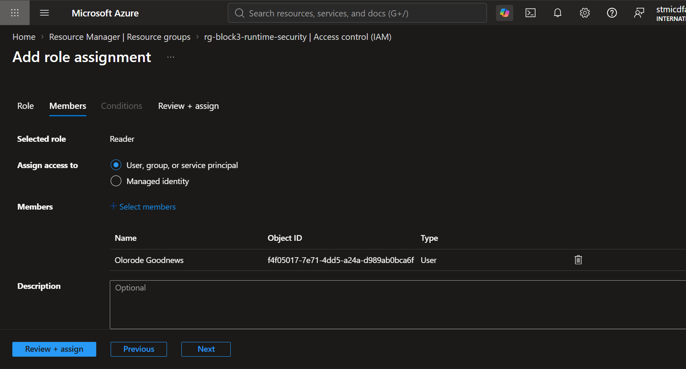

---

## Step 6.7 — Verify the Event in Sentinel

I queried Azure Activity and confirmed that the role-assignment event reached the Log Analytics workspace.

### Screenshot Evidence

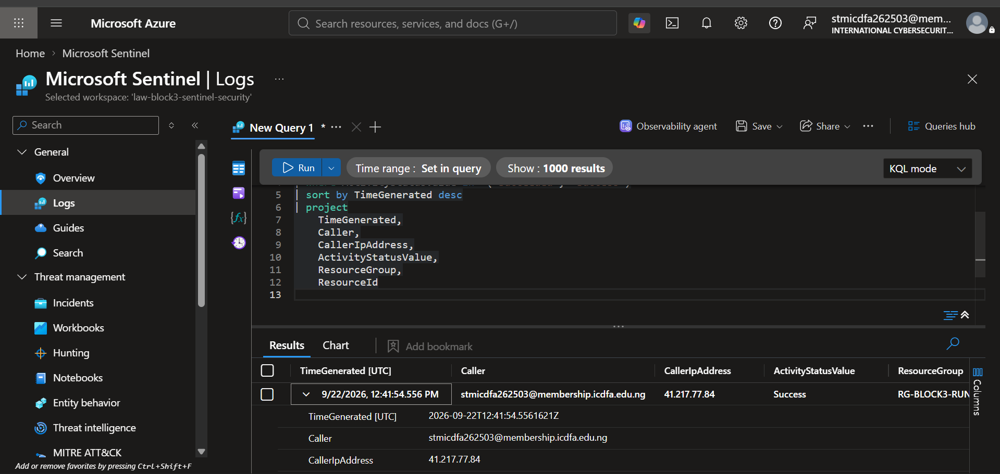

---

## Step 6.8 — Validate Incident Generation

The scheduled analytics rule detected the RBAC activity and Microsoft Sentinel generated the expected security incident.

### Screenshot Evidence

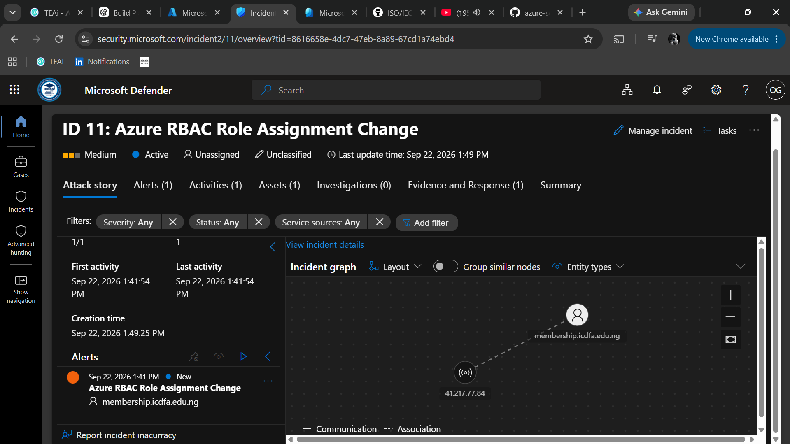

---

## Step 6 Outcome

Detection 2 was successfully implemented and validated.

---

# Step 7 — Microsoft Entra Runtime Identity Security Investigation

The Microsoft Entra environment used for the identity-security portion of Block 3 was separate from the Azure for Students tenant used for Microsoft Sentinel.

I used the licensed Microsoft Entra tenant to review identity-risk information, authentication activity, Conditional Access behavior, and audit events.

---

## Step 7.1 — Identity Protection Overview

I reviewed the Microsoft Entra Identity Protection dashboard to understand the tenant's identity-risk posture.

I did not intentionally generate unsafe authentication activity simply to create risk events.

### Screenshot Evidence

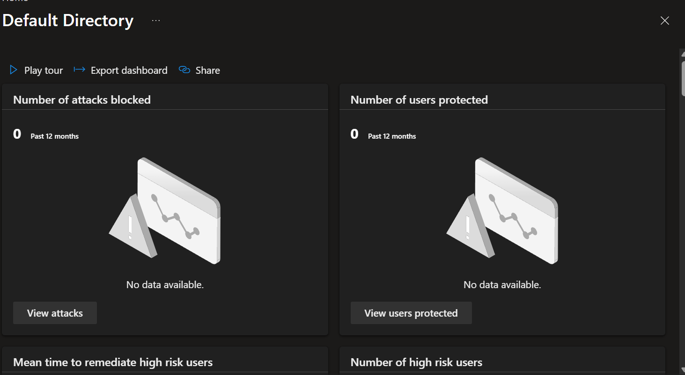

---

## Step 7.2 — Risky Users Review

I reviewed the Risky users report and the available risk information for identities in the tenant.

The screenshot inventory contains two captures of this page, and both filenames are preserved exactly as uploaded.

### Screenshot Evidence

.png>)

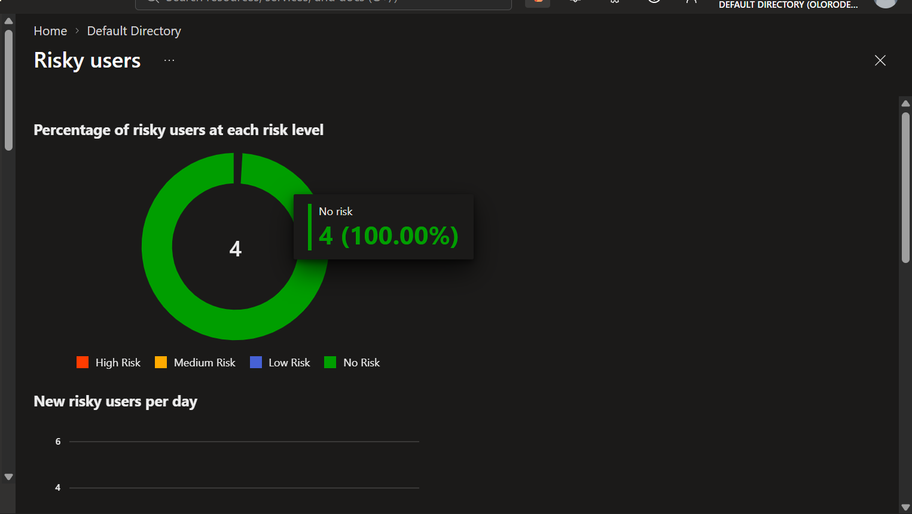

---

## Step 7.3 — Risk Detection Review

I reviewed the Risk detections section to understand how Microsoft Entra presents identity-risk signals for investigation.

### Screenshot Evidence

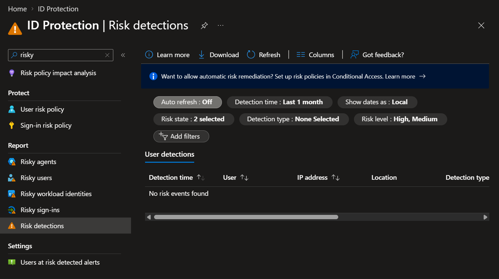

---

## Step 7.4 — Sign-in Investigation

I opened one of my own authentication events and reviewed the sign-in from a security-investigation perspective.

I reviewed:

- User
- Application
- Sign-in status
- IP address
- Location
- Authentication requirement
- Authentication details
- Conditional Access evaluation
- Device information

### Screenshot Evidence

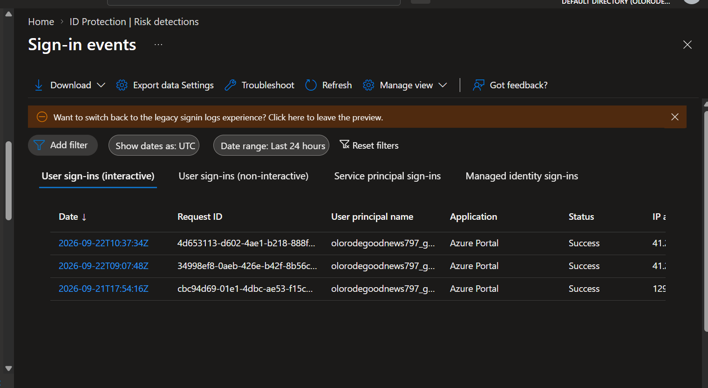

---

## Step 7.5 — Conditional Access Policy Review

I reviewed the Conditional Access policies already configured in the tenant.

The policies remained in Report-only mode while their behavior and scope were validated.

### Screenshot Evidence

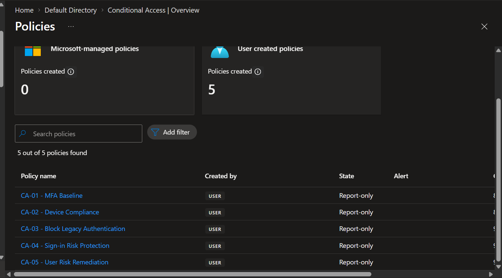

---

## Step 7.6 — Conditional Access What If Validation for a Normal User

I used the Conditional Access What If tool to test how the policies would apply to a normal user under selected sign-in conditions.

This allowed me to safely evaluate policy scope without requiring a real user to be blocked.

### Screenshot Evidence

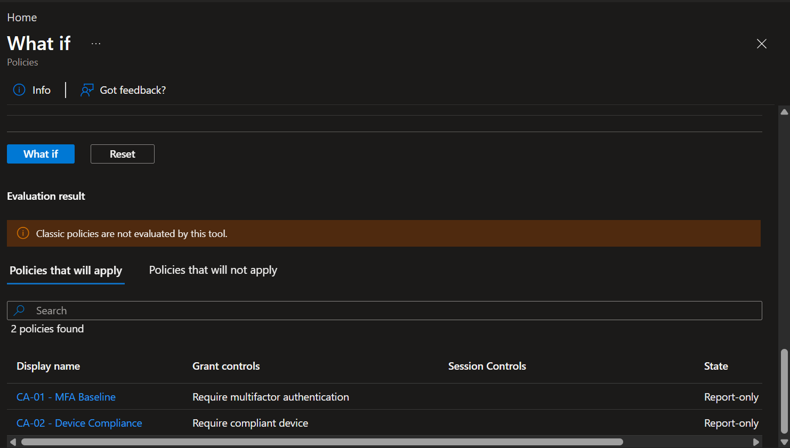

---

## Step 7.7 — Conditional Access What If Validation for the Emergency Account

I repeated the What If validation using the emergency access account.

The emergency account had previously been excluded from the Conditional Access policies so that emergency administrative access would remain available if a policy caused an unexpected lockout.

### Screenshot Evidence

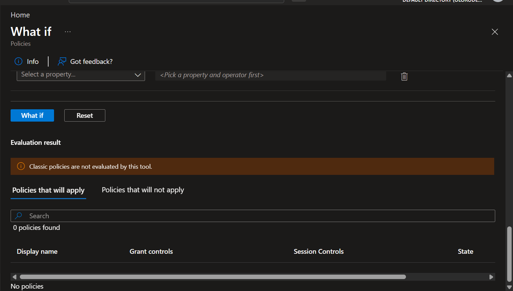

---

## Step 7.8 — Conditional Access Audit Log Review

I reviewed Microsoft Entra audit logs for Conditional Access activity.

The audit information allowed me to identify:

- Who performed a change
- What activity occurred
- Whether it succeeded
- Which object was affected
- When the activity occurred

### Screenshot Evidence

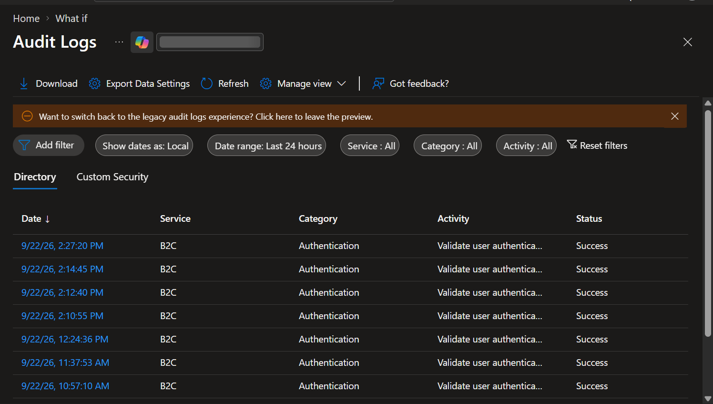

---

## Step 7.9 — Investigate an Audit Event

I opened an individual audit event and reviewed investigation fields including:

- Activity
- Date and time
- Result
- Initiated by
- Target resource
- Correlation ID
- Modified properties

### Screenshot Evidence

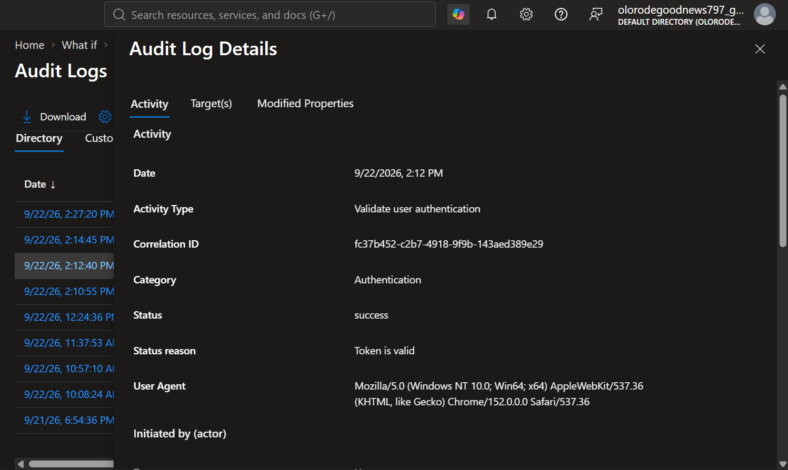

---

## Step 7 Outcome

This section demonstrated runtime identity investigation using:

- Microsoft Entra Identity Protection
- Risk reports
- Sign-in telemetry
- Conditional Access runtime validation
- Conditional Access What If
- Microsoft Entra audit logs

---

# Step 8 — Microsoft Defender Capability Review

I accessed the Microsoft Defender portal and reviewed the available Defender for Endpoint onboarding capability.

A Windows endpoint was not onboarded as part of the final Block 3 scope.

Because endpoint onboarding was not completed, I did not claim the following as implemented:

- Endpoint telemetry collection
- Device isolation
- Live Response
- Investigation package collection
- Endpoint Advanced Hunting
- Defender response actions

The documentation reflects only the work that was actually performed.

### Screenshot Evidence

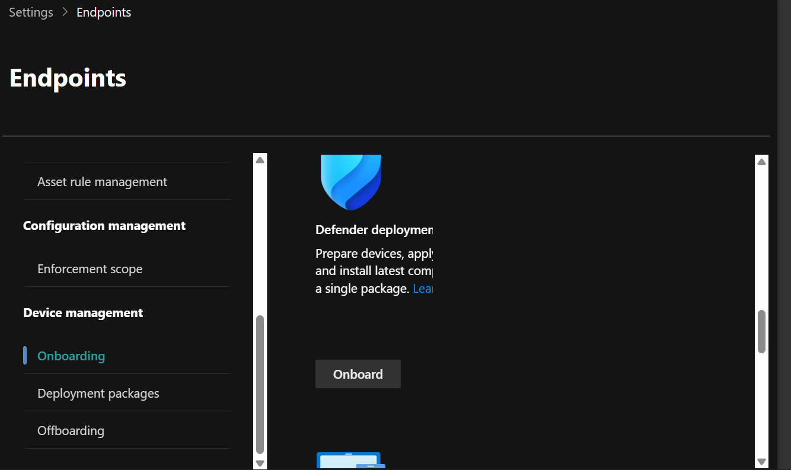

---

## Step 8 Outcome

The Defender environment and endpoint-onboarding workflow were reviewed, while endpoint onboarding itself remained outside the completed Block 3 lab scope.

---

# Step 9 — Custom Detection 3: Azure Policy Assignment Changes

In this step, I created a custom Microsoft Sentinel analytics rule to detect successful creation, modification, or deletion of Azure Policy assignments.

Azure Policy changes are security-sensitive because an unauthorized modification could weaken governance or remove security controls.

## Detection Overview

- **Detection name:** Azure Policy Assignment Change
- **Log source:** Azure Activity
- **Table:** `AzureActivity`
- **Severity:** Medium
- **MITRE ATT&CK tactic:** Defense Evasion
- **MITRE ATT&CK technique:** T1562.001 — Impair Defenses: Disable or Modify Tools
- **Possible false positive:** Approved governance administration
- **Response:** Verify the administrator, affected policy, assignment scope, and whether the modification weakened controls.

---

## Step 9.1 — Develop and Test the Detection Query

I used:

```kusto
AzureActivity
| where OperationNameValue in~ (
    "MICROSOFT.AUTHORIZATION/POLICYASSIGNMENTS/WRITE",
    "MICROSOFT.AUTHORIZATION/POLICYASSIGNMENTS/DELETE"
)
| where ActivityStatusValue in~ ("Succeeded", "Success")
| extend AccountName = iff(Caller contains "@", tostring(split(Caller, "@")[0]), Caller)
| extend AccountUPNSuffix = iff(Caller contains "@", tostring(split(Caller, "@")[1]), "")
| extend PolicyAction = case(
    OperationNameValue has "/WRITE", "Policy Assignment Created or Updated",
    OperationNameValue has "/DELETE", "Policy Assignment Deleted",
    "Unknown"
)
| project
    TimeGenerated,
    Caller,
    AccountName,
    AccountUPNSuffix,
    CallerIpAddress,
    PolicyAction,
    OperationNameValue,
    ActivityStatusValue,
    ResourceGroup,
    ResourceId,
    SubscriptionId,
    CorrelationId
| sort by TimeGenerated desc
```

The reusable detection query was stored in:

`detections/03-azure-policy-assignment-changes.kql`

### Screenshot Evidence

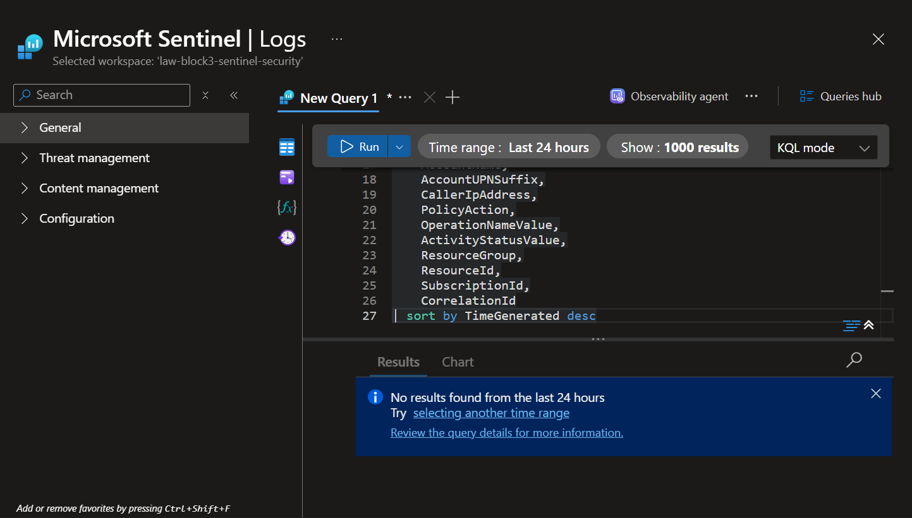

---

## Step 9.2 — Configure the Analytics Rule

I created the scheduled analytics rule and added the validated detection query.

### Screenshot Evidence

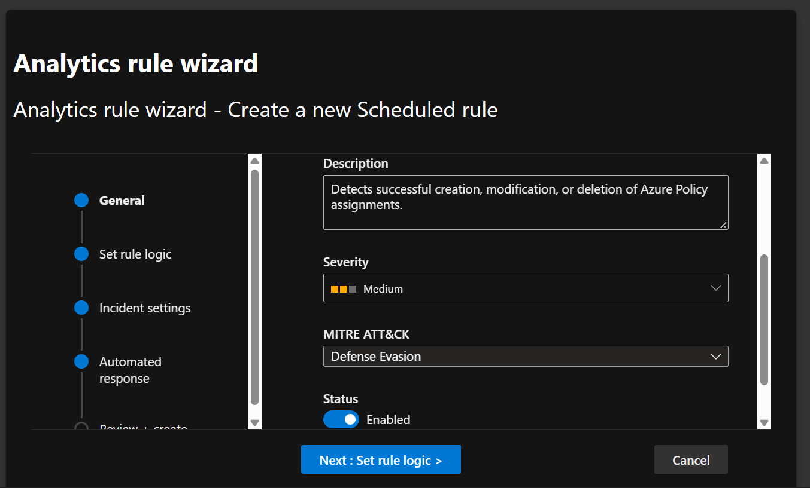

---

## Step 9.3 — Configure Entity Mapping

I mapped the initiating account and source IP address to Microsoft Sentinel entities.

### Screenshot Evidence

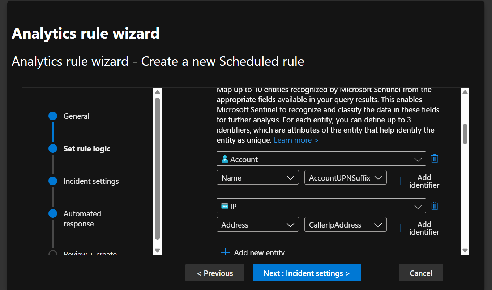

---

## Step 9.4 — Configure Custom Details

I added custom alert details for:

- Caller
- Policy action
- Resource group
- Resource ID
- Operation
- Status

### Screenshot Evidence

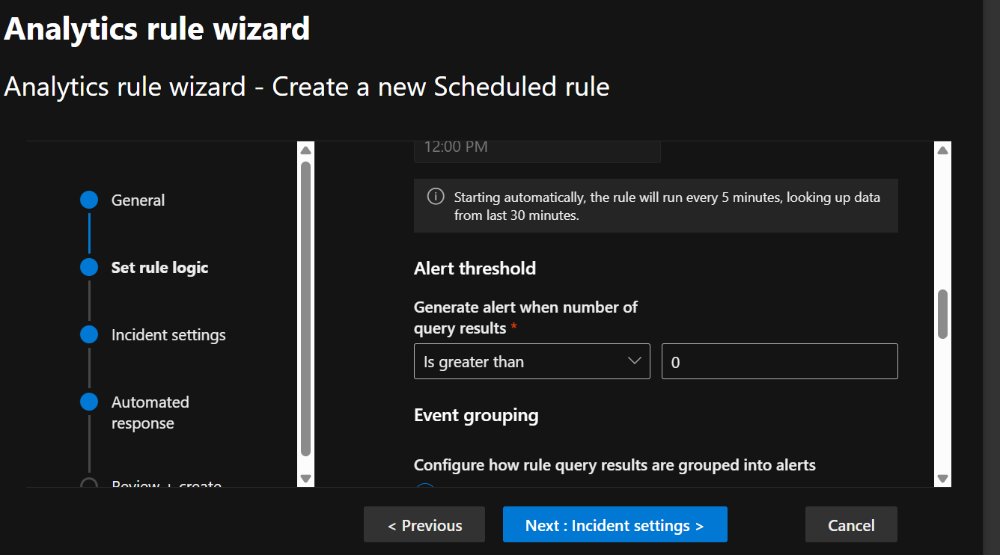

---

## Step 9.5 — Create and Enable the Rule

I completed the query scheduling, threshold, incident settings, and enabled the rule.

### Screenshot Evidence

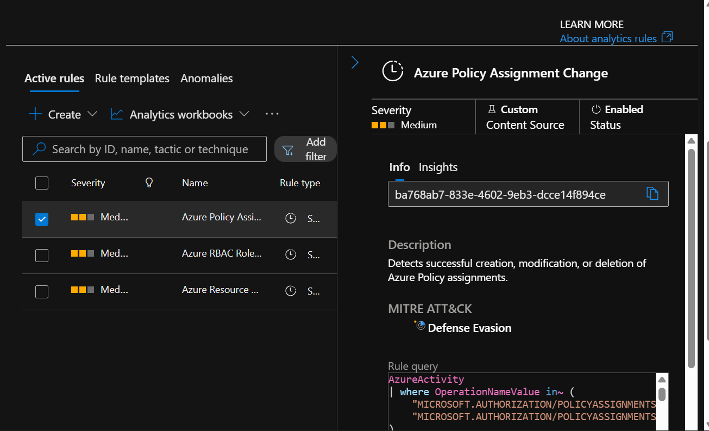

---

## Step 9.6 — Generate a Controlled Policy Event

I created a temporary audit-focused Azure Policy assignment named:

`Block3 Policy Detection Test`

The assignment was used only to generate a real policy-assignment control-plane event.

### Screenshot Evidence

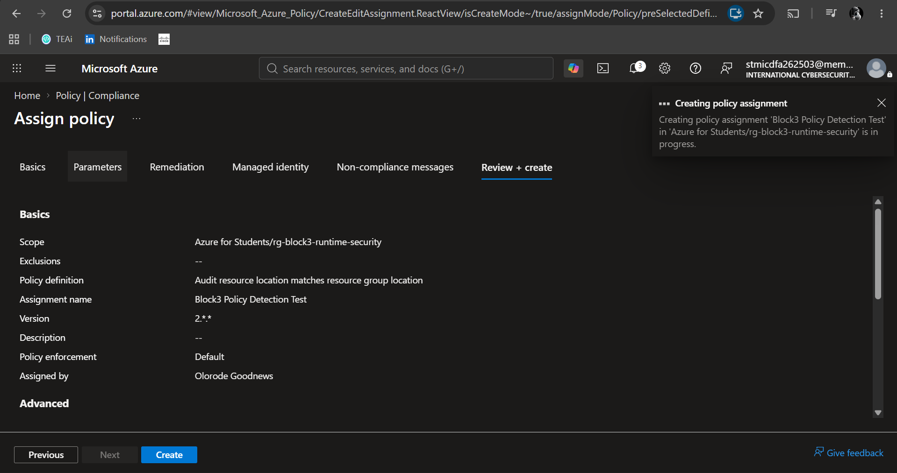

---

## Step 9.7 — Verify the Event in Sentinel

I queried `AzureActivity` and confirmed that the policy-assignment event had been ingested.

### Screenshot Evidence

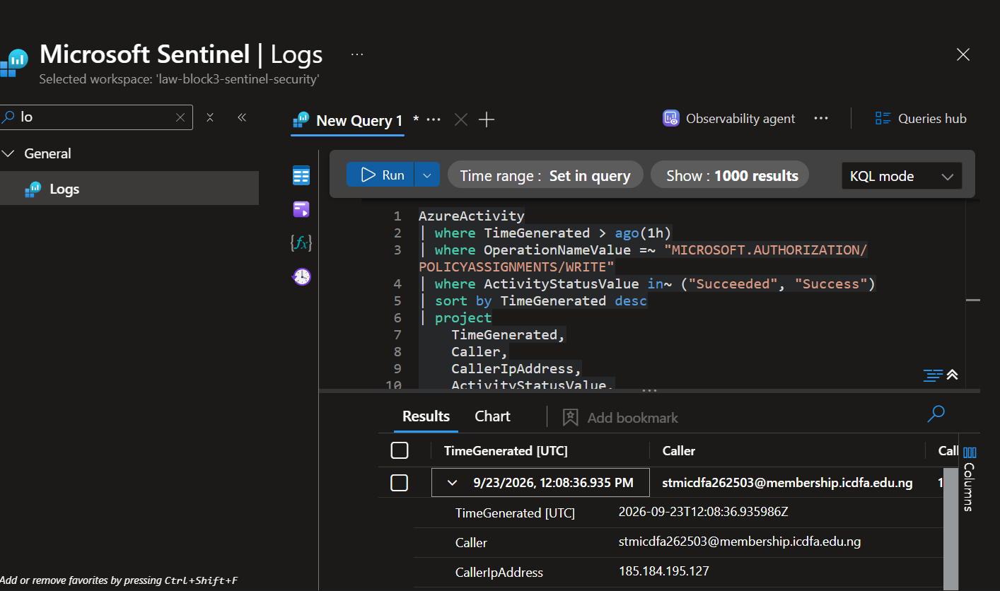

---

## Step 9.8 — Validate Incident Generation

Microsoft Sentinel generated an incident named:

`Azure Policy Assignment Change`

### Screenshot Evidence

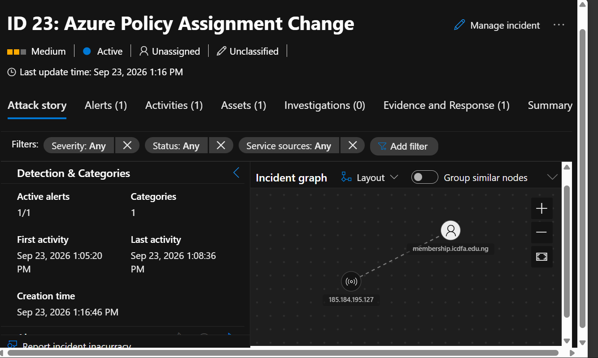

---

## Step 9 Outcome

Detection 3 was successfully implemented and validated.

---

# Step 10 — Custom Detection 4: Azure NSG Security Rule Changes

In this step, I created a custom Microsoft Sentinel analytics rule to detect successful creation, modification, or deletion of Network Security Group security rules.

Unauthorized NSG changes can expose services, remove network restrictions, or weaken network segmentation.

## Detection Overview

- **Detection name:** Azure NSG Security Rule Change
- **Log source:** Azure Activity
- **Table:** `AzureActivity`
- **Severity:** Medium
- **MITRE ATT&CK tactic:** Defense Evasion
- **MITRE ATT&CK technique:** T1562 — Impair Defenses
- **Possible false positive:** Approved network or firewall administration
- **Response:** Verify the administrator, affected NSG, security rule, authorization, and whether network exposure increased.

---

## Step 10.1 — Develop and Test the Detection Query

I used:

```kusto
AzureActivity
| where OperationNameValue in~ (
    "MICROSOFT.NETWORK/NETWORKSECURITYGROUPS/SECURITYRULES/WRITE",
    "MICROSOFT.NETWORK/NETWORKSECURITYGROUPS/SECURITYRULES/DELETE"
)
| where ActivityStatusValue in~ ("Succeeded", "Success")
| extend AccountName = iff(Caller contains "@", tostring(split(Caller, "@")[0]), Caller)
| extend AccountUPNSuffix = iff(Caller contains "@", tostring(split(Caller, "@")[1]), "")
| extend NSGAction = case(
    OperationNameValue has "/WRITE", "NSG Rule Created or Updated",
    OperationNameValue has "/DELETE", "NSG Rule Deleted",
    "Unknown"
)
| project
    TimeGenerated,
    Caller,
    AccountName,
    AccountUPNSuffix,
    CallerIpAddress,
    NSGAction,
    OperationNameValue,
    ActivityStatusValue,
    ResourceGroup,
    ResourceId,
    SubscriptionId,
    CorrelationId
| sort by TimeGenerated desc
```

The query was stored in:

`detections/04-nsg-rule-changes.kql`

### Screenshot Evidence

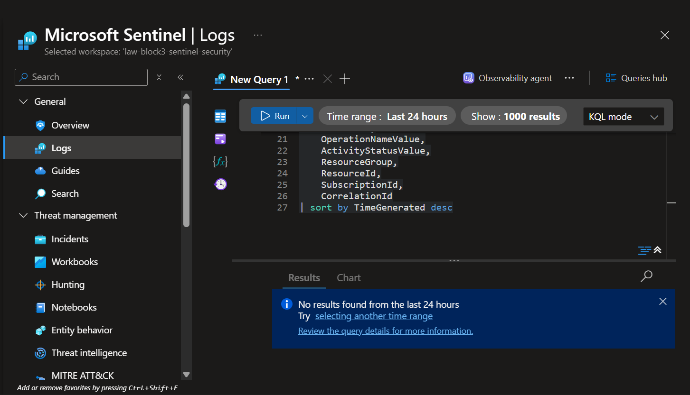

---

## Step 10.2 — Create and Enable the Analytics Rule

I configured the scheduled analytics rule, query schedule, incident creation, and investigation context.

The screenshot inventory used for this final guide does not contain separate screenshot files numbered 50–52, so I used the available rule-created evidence rather than inventing screenshot names.

### Screenshot Evidence

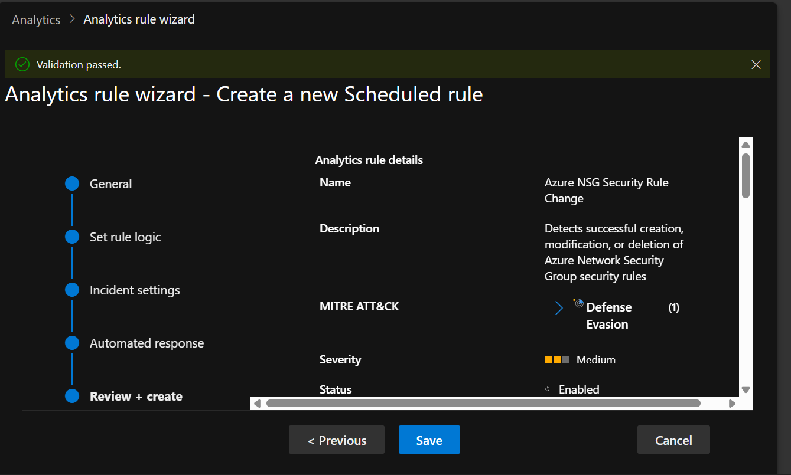

---

## Step 10.3 — Generate a Controlled NSG Rule Change

I created a temporary Network Security Group that was not associated with a subnet or network interface.

I added a temporary inbound Deny rule named:

`Block3-Test-Deny`

The test rule used:

- TCP
- Destination port 65000
- Deny
- Priority 400

This created a real Azure NSG administrative event without affecting active workloads.

### Screenshot Evidence

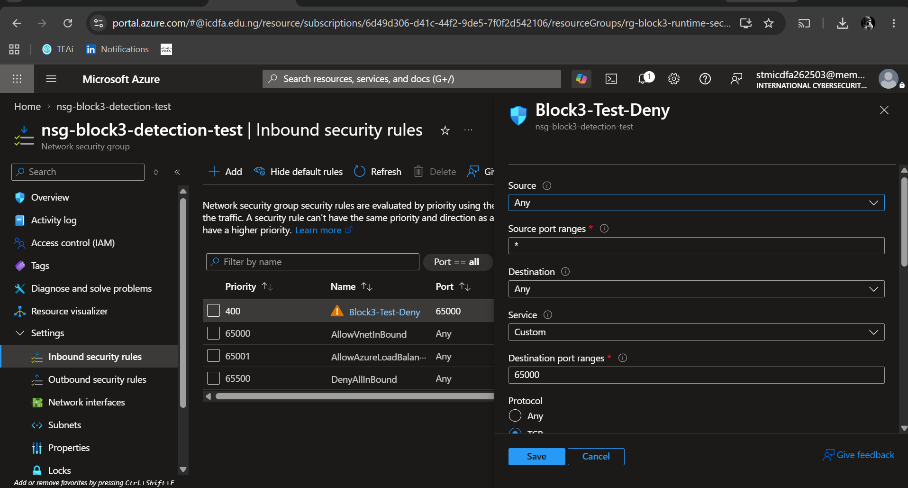

---

## Step 10.4 — Verify the Event in Sentinel

I queried Azure Activity and confirmed that the NSG rule-change event reached Log Analytics.

### Screenshot Evidence

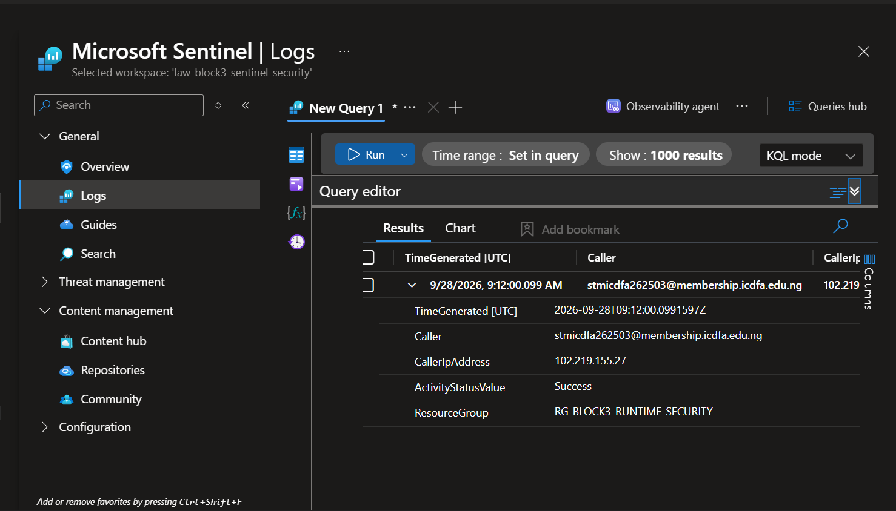

---

## Step 10.5 — Validate Incident Generation

The scheduled analytics rule detected the event and generated the expected Microsoft Sentinel incident.

### Screenshot Evidence

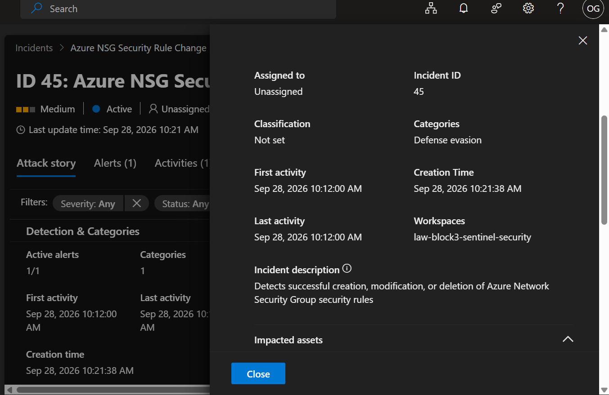

---

## Step 10 Outcome

Detection 4 was successfully implemented and validated.

The four completed custom detections were:

1. Azure Resource Group Deletion
2. Azure RBAC Role Assignment Change
3. Azure Policy Assignment Change
4. Azure NSG Security Rule Change

---

# Step 11 — Additional Key Vault Detection Work

I also started an additional custom detection focused on Azure Key Vault access-policy changes.

This work is documented as an extension and is not counted as one of the four completed detections because final event-ingestion and incident validation were not completed.

---

## Step 11.1 — Develop the Key Vault Detection Query

The detection searched for successful Key Vault access-policy write operations.

### Screenshot Evidence

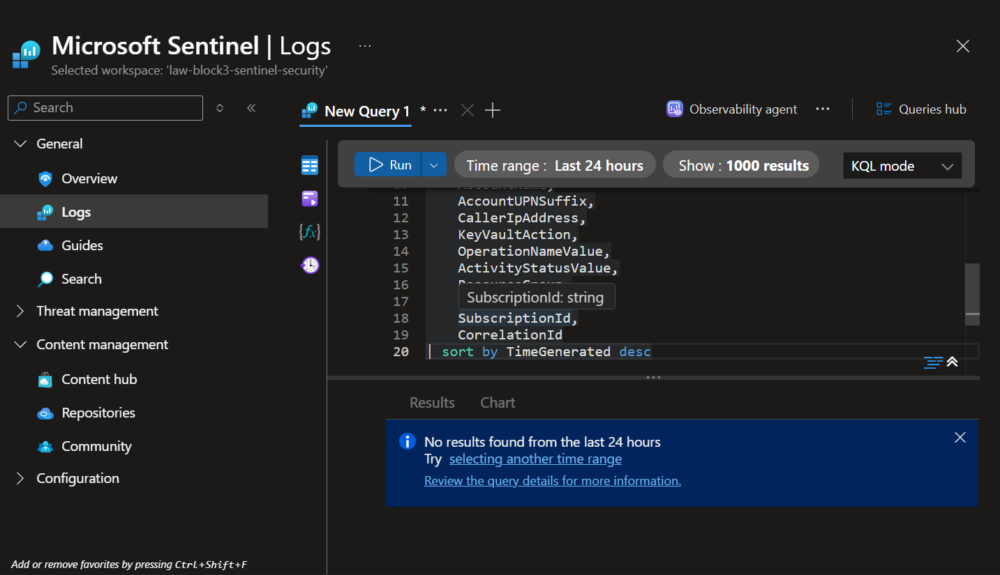

---

## Step 11.2 — Configure the Key Vault Analytics Rule

I configured the rule details and detection logic.

### Screenshot Evidence

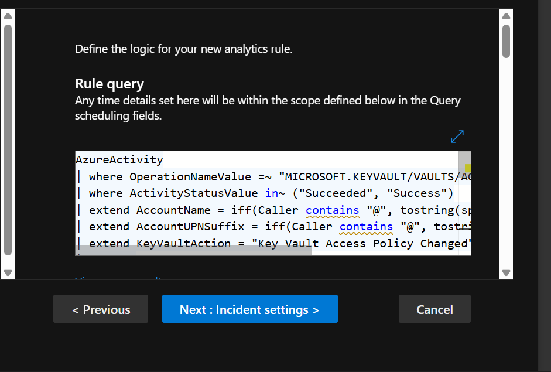

---

## Step 11.3 — Configure Entity Mapping

I configured account and IP entity mappings for investigation context.

### Screenshot Evidence

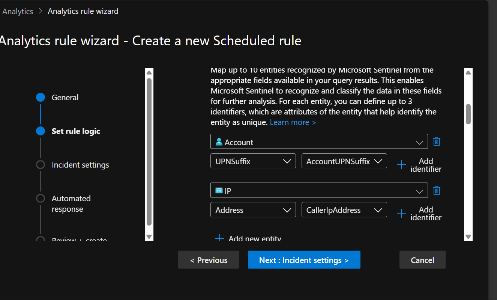

---

## Step 11.4 — Configure Custom Details

I added custom alert details for:

- Caller
- Key Vault action
- Resource group
- Resource ID
- Operation
- Status

### Screenshot Evidence

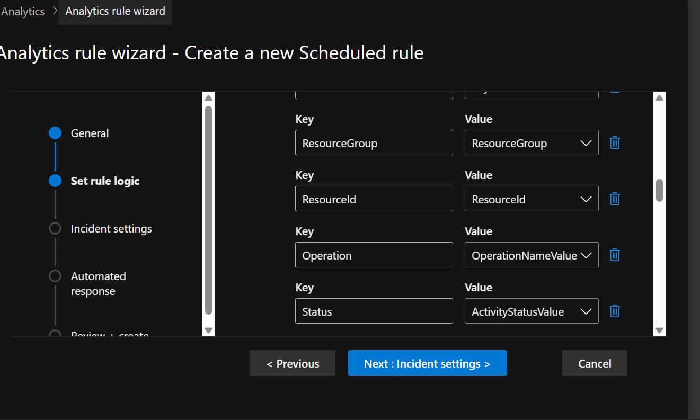

---

## Step 11.5 — Create the Rule

I created the Key Vault analytics rule.

### Screenshot Evidence

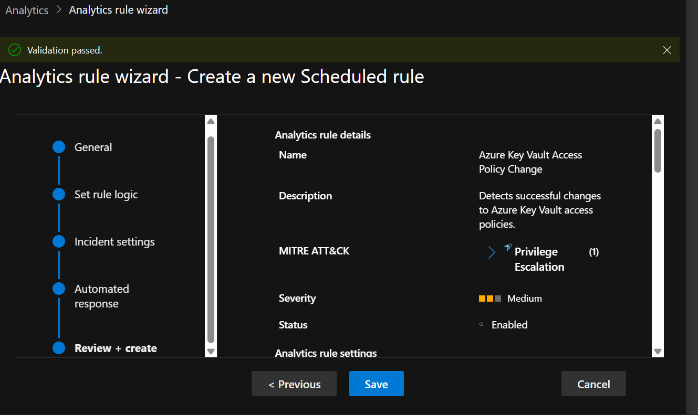

---

## Step 11.6 — Generate a Test Access-Policy Change

I created a controlled Key Vault access-policy change to generate a real administrative event.

### Screenshot Evidence

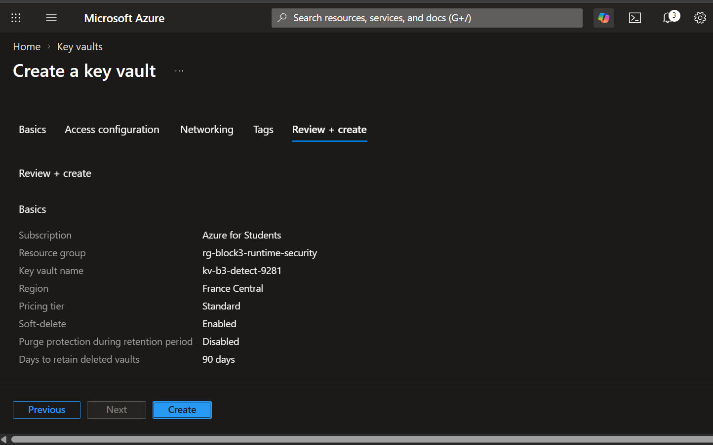

---

## Step 11 Outcome

The Key Vault detection was configured and a controlled access-policy change was generated.

However, it is not included in the final completed detection count because the supplied evidence does not include final event-ingestion and incident validation.

---

# Step 12 — SIEM Engineering and SOAR Automation

After completing the core detection work, I focused on the operational side of Microsoft Sentinel.

The goals were to:

- Review ingestion and cost
- Understand security-event volume
- Establish a basic Azure activity baseline
- Analyze Sentinel data
- Automate incident triage

---

## Step 12.1 — Review Log Analytics Usage and Cost

I reviewed the Log Analytics workspace usage and estimated cost.

Monitoring ingestion is important because SIEM cost is closely related to the volume of data collected and retained.

### Screenshot Evidence

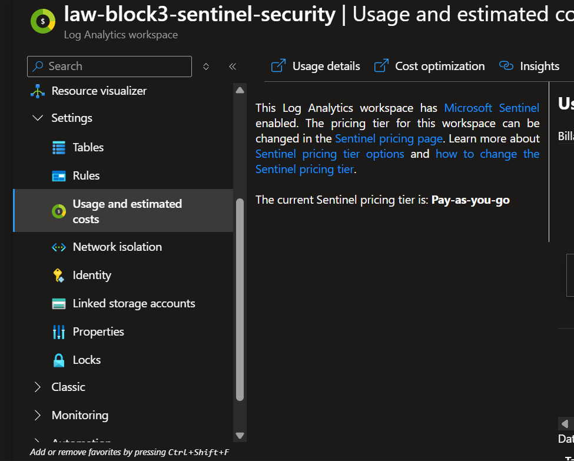

---

## Step 12.2 — Analyze Daily Azure Activity Volume

I used KQL to count Azure Activity events per day:

```kusto
AzureActivity
| summarize EventCount=count() by bin(TimeGenerated, 1d)
| sort by TimeGenerated asc
```

This provided visibility into how much Azure control-plane activity was being collected each day.

### Screenshot Evidence

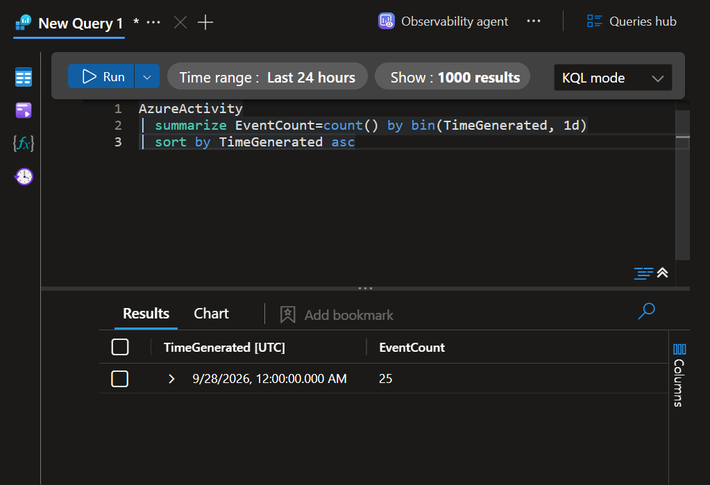

---

## Step 12.3 — Compare Sentinel Table Ingestion

I compared event counts and approximate data volume across the primary Sentinel tables.

```kusto
union isfuzzy=true withsource=TableName
    AzureActivity,
    SecurityAlert,
    SecurityIncident
| summarize
    EventCount=count(),
    DataMB=round(sum(_BilledSize) / 1024 / 1024, 2)
    by TableName
| sort by EventCount desc
```

This helped me understand which tables were generating the most records and approximate data volume.

### Screenshot Evidence

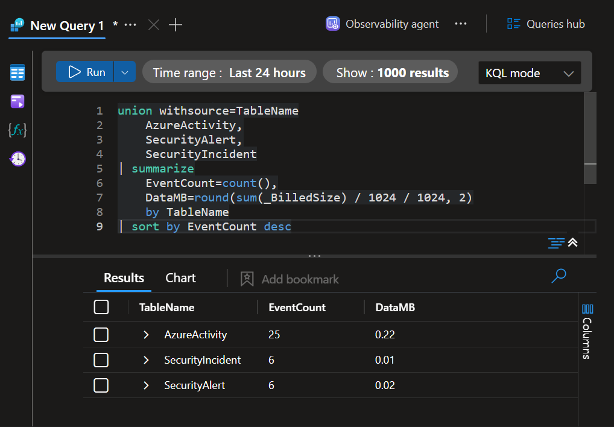

---

## Step 12.4 — Establish an Azure Activity Baseline

I identified the most common Azure control-plane operations.

```kusto
AzureActivity
| summarize EventCount=count() by OperationNameValue
| top 15 by EventCount desc
```

This provided a basic normal-activity baseline that could support future detection tuning.

### Screenshot Evidence

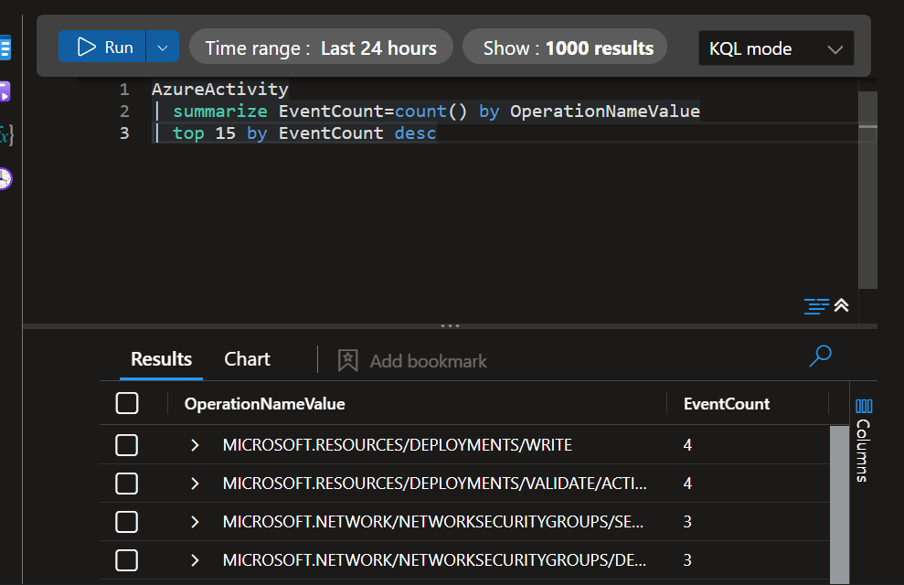

I stored the reusable SIEM engineering queries in:

`kql/siem-ingestion-analysis.kql`

---

# Step 12.5 — Create the SOAR Automation Rule

I created a Microsoft Sentinel automation rule to automatically triage incidents generated by:

`Azure NSG Security Rule Change`

The automation configuration was:

- **Trigger:** When an incident is created
- **Condition:** Analytic rule name contains `Azure NSG Security Rule Change`
- **Action:** Add the `Network-Security` tag
- **Status:** Enabled
- **Expiration:** Indefinite

### Screenshot Evidence

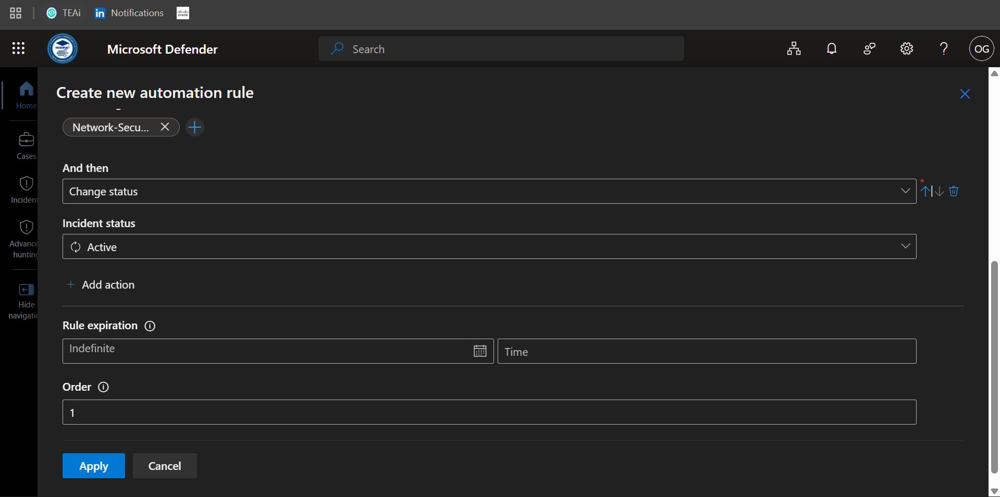

---

## Step 12.6 — Verify the Automation Rule

I confirmed that the automation rule existed under Microsoft Sentinel automation rules and was enabled.

### Screenshot Evidence

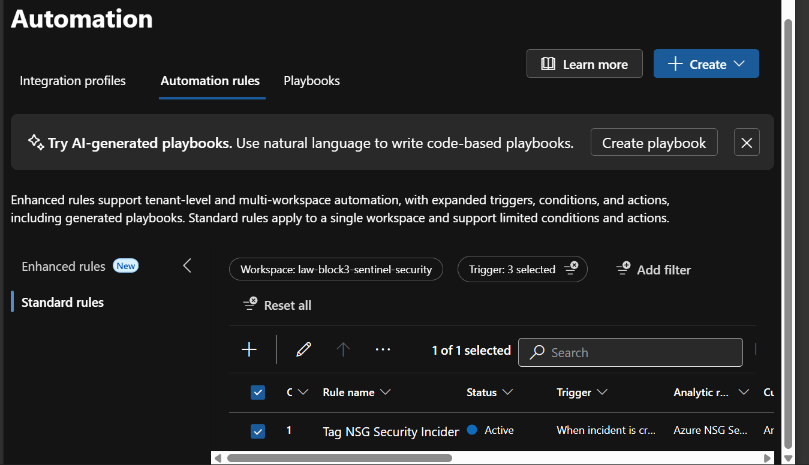

---

## Step 12.7 — Validate Automated Incident Triage

I generated a new controlled NSG security-rule change after the automation rule was enabled.

The existing custom NSG analytics rule detected the activity and created a new Sentinel incident.

Because the incident matched the automation-rule condition, Microsoft Sentinel automatically added the:

`Network-Security`

tag.

I did not manually add the tag.

### Screenshot Evidence

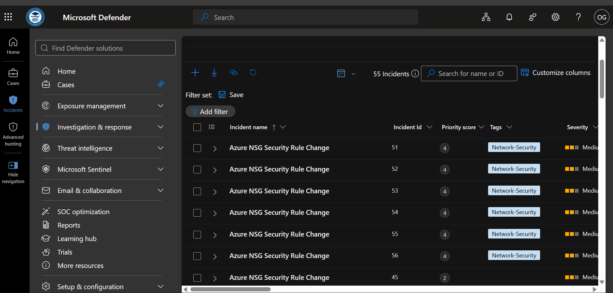

---

## Validated SOAR Workflow

The completed automated workflow was:

`Azure NSG Rule Change`

↓

`Azure Activity`

↓

`Microsoft Sentinel`

↓

`Custom Analytics Rule`

↓

`Security Alert`

↓

`Sentinel Incident`

↓

`Automation Rule`

↓

`Network-Security Tag`

The SOAR automation implementation was also documented separately in:

`soar/nsg-incident-automation.md`

---

## Step 12 Outcome

This section demonstrated basic SIEM engineering and Security Orchestration, Automation, and Response.

I demonstrated that I could:

- Review SIEM usage and estimated cost
- Analyze security-event volume
- Compare ingestion across Sentinel tables
- Establish a baseline of Azure administrative operations
- Create a Microsoft Sentinel automation rule
- Scope automation to a specific custom analytics rule
- Automatically classify a newly generated incident
- Validate a complete detection-to-automation workflow

---

# Final Block 3 Outcome

At the end of Block 3, I had implemented and validated a runtime-security workflow covering:

- Microsoft Sentinel onboarding
- Azure Activity log ingestion
- KQL log analysis
- Custom detection engineering
- Microsoft Entra runtime identity investigation
- Conditional Access runtime validation
- Microsoft Defender capability review
- SIEM ingestion analysis
- Security incident investigation
- SOAR automation

## Completed Custom Detections

1. **Azure Resource Group Deletion**
2. **Azure RBAC Role Assignment Change**
3. **Azure Policy Assignment Change**
4. **Azure NSG Security Rule Change**

## Additional Detection Work

I also configured:

**Azure Key Vault Access Policy Change**

This was treated as additional detection work and was not counted among the four completed detections because final event-ingestion and incident validation were not completed.

---

# Final Security Operations Flow

The final Block 3 security operations workflow was:

`Azure Administrative Activity`

↓

`Azure Activity Logs`

↓

`Log Analytics`

↓

`Microsoft Sentinel`

↓

`KQL Detection`

↓

`Analytics Rule`

↓

`Security Alert`

↓

`Sentinel Incident`

↓

`Automation Rule`

↓

`Automated Incident Triage`

This completed the Block 3 runtime security implementation.
